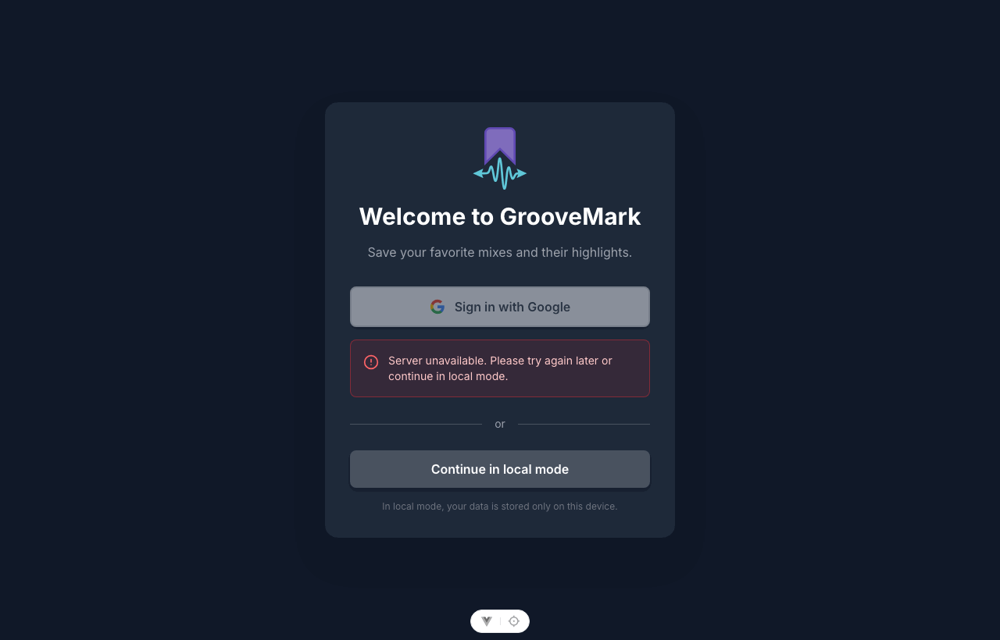

<p align="center">
  
</p>

# GrooveMark <!-- omit from toc -->

<p align="center">
  <a href="https://baptiste-pasquier.github.io/groovemark/">
    
  </a>
</p>

<p align="center">
  
</p>

GrooveMark is a Vue 3 music bookmarking application for saving your favorite sets with
precise timestamps, powered by PocketBase with a local offline fallback.

- [Features](#features)
- [Architecture](#architecture)
- [Technologies](#technologies)
- [Documentation](#documentation)
- [Quick Start](#quick-start)
  - [Docker](#docker)
  - [Local Development](#local-development)

## Features

- 🎵 **Save Mixes**: Save favorite YouTube and SoundCloud mixes
- ⏱️ **Timestamps**: Add timestamps to mark important parts of your mixes
- 🏷️ **Artist Filtering**: Organize your collection by artists
- 🔍 **Search**: Quickly find specific mixes
- 🔐 **Authentication**: Sign in with Google SSO or continue in local mode
- ☁️ **Cloud Sync**: Authenticated sessions sync favorites through PocketBase
- 🔌 **Offline Support**: Local mode stores data in browser localStorage
- 💾 **Import/Export**: Backup and restore favorites as JSON
- 🐳 **Docker Deployment**: Ready for local and CI/CD-based deployments

## Architecture

GrooveMark is built as a modern Single Page Application (SPA) with a
Backend-as-a-Service (BaaS) architecture.

- **Frontend**: A Vue 3 application that handles the UI, state management, and business
  logic. It communicates with the backend via the PocketBase SDK.
- **Backend**: PocketBase serves as the all-in-one backend, providing:
  - **Database**: SQLite-based data storage for favorites and users.
  - **Authentication**: Handles Google SSO and session management.
  - **API**: REST API for data synchronization.
- **Offline Capability**: The application switches between PocketBase (online) and
  `localStorage` (offline or local mode), ensuring the app remains functional without an
  internet connection.
- **Deployment**: The entire stack is containerized using Docker, with Nginx serving the
  frontend and PocketBase running in a separate container.

## Technologies

| Category          | Stack                                                                                                                                 |
| :---------------- | :------------------------------------------------------------------------------------------------------------------------------------ |
| **Core Frontend** | [Vue 3](https://vuejs.org/) (Composition API), [TypeScript](https://www.typescriptlang.org/), [Vite v7](https://vite.dev/)            |
| **State & Utils** | [Pinia v3](https://pinia.vuejs.org/), [VueUse](https://vueuse.org/), [Vue I18n](https://vue-i18n.intlify.dev/)                        |
| **UI & Styling**  | [Tailwind CSS v4](https://tailwindcss.com/), [Lucide Vue](https://lucide.dev/)                                                        |
| **Backend & Ops** | [PocketBase](https://pocketbase.io/), [Docker](https://www.docker.com/)                                                               |
| **Testing & QA**  | [Vitest](https://vitest.dev/), [Playwright](https://playwright.dev/), [ESLint](https://eslint.org/), [Prettier](https://prettier.io/) |

## Documentation

- **[Development Guide](./docs/DEVELOPMENT.md)** - Local setup, IDE notes, and development
  commands
- **[Architecture Notes](./docs/ARCHITECTURE.md)** - Bootstrap flow, persistence model,
  storage keys, and import behavior
- **[Responsive Layout Notes](./docs/RESPONSIVE_LAYOUT.md)** - Layout tokens, shell width
  formulas, and breakpoint reasoning for the favorites view
- **[Demo Preview](./docs/DEMO_PREVIEW.md)** - README demo GIF details and regeneration
  workflow
- **[Changelog](./CHANGELOG.md)** - Notable project changes and documentation updates
- **[PocketBase Setup](./docs/POCKETBASE_SETUP.md)** - Backend installation, collection
  setup, rules, and environment configuration
- **[Pocketbase Schema](./docs/POCKETBASE_SCHEMA.md)** - Favorites collection schema and
  migration notes
- **[Authentication Setup](./docs/AUTHENTICATION.md)** - Google SSO and local mode guide
- **[Docker Deployment](./docs/DOCKER.md)** - Docker Compose, production deployment,
  troubleshooting, and CI/CD

## Quick Start

### Docker

```bash
git clone https://github.com/baptiste-pasquier/groovemark.git
cd groovemark/docker
docker-compose up -d
```

Access the app at `http://localhost:8080` and PocketBase at `http://localhost:8090/_/`.

### Local Development

```bash
npm install
npm run dev
```

See [Development Guide](./docs/DEVELOPMENT.md) for the full workflow and
[PocketBase Setup](./docs/POCKETBASE_SETUP.md) for authenticated mode.
