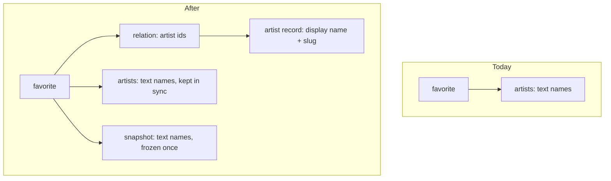
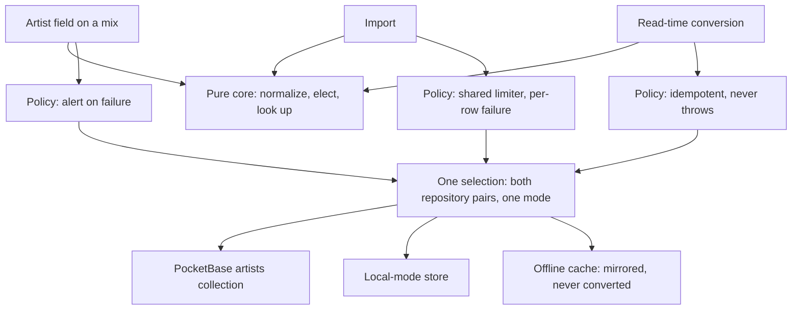

# Artist Entity - Plan

## Goal Capsule

- **Objective:** Every mix that credits the same performer points at one artist, spelling variants included, so the artist list stops showing the same person twice.
- **Means:** Promote artists into a record of their own, created inline from the artist field, with the schema shipped as PocketBase migrations and the data converted client-side (KTD2).
- **Product authority:** This plan owns the artist entity and the conversion of existing artist names. Renaming, merging, the artist view, and everything about events are not active scope — see How This Work Fits Together.
- **Execution profile:** Cross-cutting. New collection, new store, new repository pair, and a one-time data conversion that touches every stored favorite. Ships behind no flag; the conversion is the deploy.
- **Stop conditions:** Stop and ask if a requirement here would need the artist view to exist, if a PocketBase migration would need to touch record data, or if the safety-net column would have to be written more than once per favorite.
- **Tail ownership:** This plan ends at a green branch. Commit, PR, and CI belong to whoever runs the shipping step.

---

## Product Contract

### Summary

Artists become a record identified independently of their display name. Typing an unknown name in a mix's artist field creates one on the spot; typing a known name under a different casing or accent reuses the existing one. A one-time conversion turns the artist names already stored on each favorite into records, collapsing spelling variants, and freezes a copy of the original strings so the collapse can be undone once renaming exists.

### Problem Frame

An artist exists in GrooveMark only as a string copied into each favorite's `artists` array (`src/types/favorite.ts:11`). Nothing binds two copies of the same name together, so the app contradicts itself: the artist field suggests `amelie lens` while the user types `AMELIE`, then stores the typed form as a separate artist because tag deduplication compares exactly (`src/components/favorites/ArtistTagsInput.vue`). The grid filter compares exactly too (`src/stores/favoritesUi.ts:51`), so the two spellings filter to two disjoint sets of mixes.

The cost is invisible until artists are used as an axis rather than a label. A per-artist view that gathers everything about a performer is only as trustworthy as the join it rests on, and a join on free text drifts every time a name is retyped. That drift is unrecoverable today: nothing in the app can merge two spellings after the fact.

### Requirements

**Artist identity**

- R1. An artist is a record identified independently of its display name, and a favorite references artists by that identity rather than by a copied name string.
- R2. Typing a name with no matching artist in a mix's artist field creates that artist inline. No separate screen is visited to create one.
- R3. Suggestion and matching in the artist field ignore case, accents, and surrounding whitespace.
- R4. An artist record carries a display name and nothing else.
- R5. The artist list, the grid's artist filter, and the search box operate on artist identity, so filtering by an artist returns every mix crediting them regardless of how the name was typed.
- R8. An artist that no record references stops appearing in the artist list.
- R16. Every artist reference a stored favorite carries resolves to a name in the mode that stored it, including while the backend is unreachable.

**Conversion of existing data**

- R9. Existing artist names become artist records without user action; names matching one another under R3 collapse into a single artist whose display name is the most frequent spelling.
- R10. The conversion reports no summary of what it collapsed.
- R11. The conversion runs against the PocketBase collection and the local-mode browser store. It never runs against the offline cache, which is read-only and re-mirrored from the server.
- R17. Each favorite keeps a frozen copy of the artist name strings it held before the conversion. Nothing the user does afterwards rewrites that copy.
- R18. A conversion or import that cannot create an artist leaves the affected favorite unchanged rather than crediting it with fewer artists than it had.

**Compatibility**

- R12. The JSON export keeps its current shape — an array of favorites carrying artist names written out in full.
- R13. Importing a file resolves each artist name to an existing artist or creates one, so a file exported before this change still imports. An existing artist's display name is never changed by an import.

**Access control**

- R14. The artists collection is readable and writable only by the account that owns the record, on create as well as on read, update and delete, and rejects an owner submitted by anyone else.

### Data shape

### Key Decisions

- **Artists become a record rather than normalized strings.** An identity removes the ghost-artist class outright instead of making it repairable after the fact. (session-settled: user-directed — chosen over keeping names as normalized strings with a merge-and-rename tool: cleaner, and the events work will lean on this join.) Governs R1, R2, R5.
- **This work ships before the events feature, as its own plan.** Building events first would cement the current name-matching inconsistency in a second place. (session-settled: user-directed — chosen over one combined plan and over events-first.)
- **Renaming and the merge that falls out of it ship with the artist view, not here.** The rename belongs on the artist page rather than bolted onto the filter list. (session-settled: user-directed — chosen over a minimal rename affordance now, a non-destructive conversion, or pulling a reduced artist view forward: the window without a repair path is accepted.) Governs the deferred entry in Scope Boundaries.
- **The conversion reports no summary of what it collapsed.** (session-settled: user-directed — chosen over a first-run summary naming what merged.) Governs R10.
- **An artist carries a name only.** Links, a comment and a rating are deferred, not rejected. (session-settled: user-directed — chosen over adding any of them now.) Governs R4.
- **The export stays denormalized.** Writing names out in full keeps the entity internal and keeps older exports importable. Governs R12, R13.
- **Artists belong to one account, scoped exactly like favorites.** A shared table would leak one account's typos into another's list. (session-settled: user-approved — chosen over one artist table shared across accounts.) Governs R14, R16.
- **Each favorite keeps a frozen copy of its pre-conversion names.** With renaming deferred there is otherwise no way to undo a wrong collapse, and no PocketBase migration in this repo has ever been irreversible. (session-settled: user-approved — chosen over dropping the names as part of the conversion.) Governs R17.
- **Conversion completion stays unobservable.** Production has one user, who is also the author, so a single sign-in converts the only store that exists. (session-settled: user-directed — chosen over a per-store conversion marker, which would have made completion observable at the cost of a second trigger mechanism.) Governs the accepted limitation in Scope Boundaries.

### Key Flows

- F1. Crediting an artist on a mix
  - **Trigger:** The user types into a mix's artist field.
  - **Steps:** The field suggests artists matching what has been typed, ignoring case, accents and whitespace. Accepting a suggestion credits that artist. Committing a name with no match resolves it on save: an existing artist is reused, otherwise one is created.
  - **Outcome:** The mix references one artist per credit, and no artist exists twice under two spellings.
  - **Covers:** R2, R3.

- F3. First read after the change
  - **Trigger:** A store is read and its favorites carry no frozen snapshot yet.
  - **Steps:** The pre-conversion names are frozen onto each favorite. Names matching one another under R3 collapse into one artist named by the most frequent spelling across the whole store. The favorites are rewritten to reference those records. The offline cache is never a target.
  - **Outcome:** The artist list holds no two entries differing only by case, accents or whitespace. No summary is shown.
  - **Covers:** R9, R10, R11, R17.

### Acceptance Examples

- AE1. **Covers R3.** Given an artist named `Amelie Lens`, when the user types `AMELIE LENS` into another mix's artist field and saves, then the mix credits the existing `Amelie Lens` and no second artist is created.
- AE4. **Covers R9.** Given three mixes crediting `Amelie Lens` and one crediting `amelie lens`, when the conversion runs, then one artist named `Amelie Lens` credits all four.
- AE5. **Covers R8.** Given an artist credited by exactly one mix, when that credit is removed from the mix, then the artist no longer appears in the artist list.
- AE6. **Covers R13.** Given a JSON file exported before this change, when it is imported, then each artist name in it resolves to an existing artist or creates one, and no import error is raised for the artist field.
- AE7. **Covers R3.** Given a mix already crediting `Amelie Lens`, when the user types `AMELIE` and saves, then the mix credits that artist once, not twice.
- AE8. **Covers R2.** Given the artist field, when the user commits a name that is empty once trimmed, then no artist is created and no credit is added.
- AE9. **Covers R13.** Given an import file whose favorites carry both `Amelie Lens` and `amelie lens`, when it is imported, then both resolve to one artist.
- AE10. **Covers R11.** Given an authenticated session that has fallen back to the offline cache, when favorites are read, then the conversion does not run and no write is attempted.
- AE12. **Covers R16.** Given a session that converted while online, when the backend becomes unreachable and favorites load from the cache, then every favorite still displays its artist names.
- AE13. **Covers R17.** Given a favorite converted by a previous run, when the user edits it and removes one artist, then its frozen snapshot is unchanged.
- AE14. **Covers R9.** Given a conversion interrupted after some favorites were rewritten, when the next read completes it, then the elected display names are identical to those an uninterrupted run would have produced.
- AE15. **Covers R9, R17.** Given a converted favorite whose credits the user removed entirely, when it is read again, then no artist is credited and the conversion does not run against it.
- AE16. **Covers R18.** Given two sessions converting the same library at once, when both settle, then exactly one artist exists per normalized name and no favorite credits fewer artists than its snapshot holds.
- AE17. **Covers R13.** Given an existing artist `Amelie Lens`, when a file carrying only `amelie lens` is imported, then the existing artist is credited and its display name is unchanged.

### Scope Boundaries

**Deferred for later**

- Renaming an artist, and the merge that falls out of renaming onto an existing name. Both arrive with the artist view.
- Links on an artist record (Instagram, SoundCloud), a free-text comment, and a rating.
- Aliases — a second name pointing at the same artist without renaming it.
- A management screen listing artists with explicit merge and delete actions.
- Deleting artist records that nothing references. The collection grows monotonically for now; R8 hides them from the list. The consequence to expect: a name typed wrong once stays suggestible forever, because KTD14 draws suggestions from every loaded artist while R8 only hides unreferenced ones from the filter list. Removal arrives with the artist view's rename and merge.

**Deferred to follow-up work**

- Dropping the frozen snapshot column once renaming exists and the safety net is no longer needed. Track it as a repository issue rather than here.

**Accepted limitations**

- Conversion completion is not observable. The conversion only runs when a browser reads a store, so nothing reports that every account has converted. Accepted because production has one user, who is also the author: a single sign-in converts the only store that exists. The cost lands on the follow-up above — dropping the snapshot column has no automatic precondition to check — and on the events work, which would meet an unconverted favorite with an empty relation. Revisit before a second account exists. A per-store conversion marker was the alternative, rejected with the trigger decision in KTD3.

**Not addressed by this plan**

- Everything about events, venues and live performances. That work is the subject of a separate brainstorm and depends on this one.
- Reconciliation of writes made while the backend is unreachable. The offline cache is read-only by design (`src/stores/favorites.ts:118`); this plan neither widens nor closes that.
- Recovering pre-collapse spellings from a JSON export. The export is denormalized by decision, so a backup taken after the conversion carries collapsed names only.

### Success Criteria

- After the conversion, the artist list contains no two entries differing only by case, accents or whitespace.
- A JSON file exported before this change imports without error and without creating duplicate artists.
- A first-read conversion of a large library completes without tripping the server's rate limit on either its create pass or its favorite-update pass, and so does a cloud-mode import of a large backup.
- Reverting both migrations against a database that has already been converted leaves every favorite carrying artist names in the favorites column, collapsed to the elected spellings, with no favorite losing a credit. The pre-collapse spellings do not survive a revert — the frozen snapshot column is dropped with the migration that added it.

<!-- ce-section: work-relationships -->

### How This Work Fits Together

This plan owns one area: artists as a first-class record. The breakdown below is how the surrounding work is currently understood, not a committed roadmap — a later plan may revise, split or discard it.

- **Artist view** — one page per performer, and the home of renaming.
  - Depends on this plan for artist identity.
  - Enables the deferred repair path: renaming, and the merge that falls out of it, both reading from the frozen snapshot this plan writes.
  - Inherits a cost from KTD12: renaming an artist must also rewrite the derived names column on every favorite crediting it, or the export keeps emitting the old spelling and a re-import creates a second artist.
- **Events and live performances** — recording the nights and festivals attended, each carrying a name, a date, a venue, and the performers seen there with a score for that night's set.
  - Depends on this plan: the score is only useful next to what is already known about the performer, and that join is what this plan makes trustworthy.
  - Still to decide: an event as a container holding scored performances, and three top-level views, were explored in the dialogue that produced this plan but none of it is settled.

### Sources

- `src/types/favorite.ts:11` — `artists` is `string[]` on `Favorite`; no artist type exists.
- `src/services/storage.ts:61-69` — `readStorage` is an unchecked `JSON.parse(raw) as T`, so the local path gets no compile-time protection from a type change.
- `src/services/localFavoritesRepository.ts:20-34` — the existing read-time migration from the legacy storage key, the pattern KTD3 reuses.
- `src/services/pocketbaseFavoritesRepository.ts:85` — `update` sends the `artists` column on every write.
- `src/stores/favorites.ts:46` — `isRateLimitedError` guards on `instanceof FavoritesRepositoryError`.
- `src/stores/favorites.ts:118,154-156,210-214` — read-only mode, the cache snapshot that re-mirrors from the server, and the write guard.
- `src/stores/favorites.ts:309-389` — the import loop, its rate limiter and its progress counter.
- `src/stores/favoritesUi.ts:30,38-39,51,55` — the derived artist list, per-artist counts, exact-match filter and name-joined search.
- `AGENTS.md:184-190` — the store-responsibility split this plan must not break.
- `pocketbase/pb_migrations/` — five tracked schema migrations, each with a working down function, baked into the Docker image.
- `docs/how-to/pocketbase-setup.md` — the documented procedure for adding a migration.
- `docs/reference/pocketbase-schema.md`, `docs/explanation/architecture.md` — the collection contract and the persistence rules this plan must keep true.

---

## Planning Contract

### Product Contract preservation

Changed, with reasons:

- **R15 removed** — it required scoping the favorites create rule to its owner. Already shipped: `pocketbase/pb_migrations/1788708315_created_favorites.js:5` carries the owner-scoped create rule, and the update rule was hardened in `pocketbase/pb_migrations/1788730000_updated_favorites.js`.
- **R6 and R7 removed from active scope** — renaming and merging move to the deferred list and ship with the artist view. AE2 and AE3, which covered R7, are removed with them. The retired IDs are not reused.
- **R11 and R16 separated.** They were conflated. R11 is the conversion's scope, which excludes the offline cache; R16 is the resolution guarantee, which includes it. The cache needs an artists mirror even though it needs no conversion.
- **R17 restated** — from "the strings stay readable" to "a frozen copy nothing rewrites", because the write path would otherwise overwrite them on the first edit.
- **R16, R17 and R18 added**; R13 gained its no-rename clause.

Everything else keeps its meaning and its ID.

### Key Technical Decisions

- KTD1. **Artist identity is an opaque record id, carried by a multi-value relation field on favorites.** The normalized name is a unique index on the artist record, not the identity, so a rename never has to move a credit from one artist to another. It is not a one-write rename: KTD12 keeps a derived copy of the display name on every favorite, so a rename must also rewrite that column on each favorite crediting the artist. Governs R1, R5.
- KTD2. **Schema ships as PocketBase migrations; data conversion runs client-side.** The repo has no data-migration precedent, no documented procedure for one, and every existing migration has a working down function — which a collapsing conversion cannot have. Keeping migrations schema-only preserves that. Chosen over a server-side backfill. Governs R9, R11.
- KTD3. **A favorite is unconverted only when it has neither a frozen snapshot nor a non-empty relation, and the snapshot is the election population.** Snapshot presence alone is not the trigger: a favorite created after the deploy never gets a snapshot — KTD11 keeps that column off the write path — so it would re-satisfy a snapshot-only trigger at every read, forever, and its already-collapsed names would join the election population. Requiring both absent skips post-deploy favorites, which are born with resolved ids, while a converted favorite whose credits were emptied stays skipped on its snapshot. A favorite with neither and no artist names has nothing to convert and takes no write. Electing display names from the snapshot where it exists and from current names otherwise, across all favorites, keeps the population constant, so an interrupted run resumes to the same result. Chosen over triggering on an empty relation alone, which a user emptying a favorite's credits would re-satisfy forever, and over a per-store conversion marker, which would also have given an observable completion signal — see the accepted limitation in Scope Boundaries. Governs R9, R17.
- KTD4. **Normalization is an NFD fold with diacritics stripped, lowercased, trimmed, and inner whitespace collapsed**, stored as a slug and backed by a unique index on owner plus slug. Chosen over a plain lowercase comparison, which leaves accented and unaccented spellings as separate artists — the case the Problem Frame names. Sorting stays on the display name so the list order does not change. Governs R3.
- KTD5. **On a frequency tie the accented spelling wins; if that does not separate the candidates, the spelling sorting first by Unicode code point on the raw name wins.** The second rule is what makes the election a total order — the accent rule decides nothing between two unaccented spellings, or between two differently accented ones, and the winner would otherwise fall out of map iteration order. The population is stated per caller: the conversion counts over the whole store's snapshots; the import counts over the file, with an existing artist always taking precedence so an import never renames one. Without a stated population the same name multiset elects differently in two stores. Governs R9, R13.
- KTD6. **The resolver splits into a pure part and a per-caller create policy.** Normalize, elect and look up over a supplied index are shared. Creating is not: the artist field needs interactive failure reaching the user, the import needs the shared rate limiter and per-row failure counting, the conversion needs idempotence and a non-throwing boot posture. Chosen over one shared create path, which would force one failure posture on three callers.
- KTD7. **A rejected create on the unique index is treated as a find.** Every caller re-reads by slug and reuses the winner, so a race between two sessions, or between the conversion and the artist field, costs a retry rather than a lost credit. Governs R18.
- KTD8. **Artist creates share the favorites rate limiter and retry path.** That requires one repository error base, or a structural rate-limit check, because the current guard tests `instanceof FavoritesRepositoryError` and a mirrored artists error type would silently bypass pacing. The conversion's create pass and its update pass both count against the budget. Governs R18 and the third success criterion.
- KTD9. **The artists store loads from app bootstrap, not from inside the favorites store.** `AGENTS.md:186-187` scopes `useAppStore` to bootstrapping and `useFavoritesStore` to favorites; loading a second domain store from favorites would violate that split and add a store edge. The conversion service takes favorites and an artists repository as arguments, so no `favorites → artists` store dependency is created. Governs R16.
- KTD10. **An artists load failure puts the session in read-only mode rather than showing an empty artist list, through a degradation flag the favorites store owns.** A writable UI over an empty resolution index re-creates artists that already exist server-side and trips the unique index. The repository error type already carries an unused `unavailable` code for exactly this. The mode cannot be forced today — `isReadOnly` is a computed over the repository mode with no setter (`src/stores/favorites.ts:118`), and favorites initialization reassigns that mode — so the favorites store gains a `degradedReadOnly` ref plus a setter, folded into `isReadOnly`, applied after favorites initialization so the selection cannot clear it. Governs R16, R18.
- KTD11. **The pre-conversion names are kept off the `Favorite` domain type and out of `FavoriteRecordInput`, and the local repository merges each record with the one already stored.** Absence is the enforcement on the PocketBase path, not a rename: `readStorage` casts with `as T` (`src/services/storage.ts:65`), so a renamed field produces no compile error on the local path, and leaving the column in the write path would let the first edit overwrite it. Absence alone does the opposite in local mode: `LocalFavoritesRepository.update` rebuilds each record as `{ ...favorite, id, created }` from the input only (`src/services/localFavoritesRepository.ts:57-60`), and `persistCacheSnapshot()` rewrites the whole storage blob from in-memory domain objects after every write — so a field absent from the domain type is dropped rather than preserved, and AE13 cannot hold. Hence the merge: the local repository preserves persisted fields it does not model. The conversion reads and writes the snapshot through its own type. Governs R17.
- KTD12. **The favorites column keeps carrying resolved display names, written on every create and update.** It makes the export projection trivial and keeps a migration rollback from stripping artists off favorites created after the deploy. It is a derived copy; the frozen snapshot is the undo evidence. The copy has a cost the artist view inherits: a rename must rewrite this column on every favorite crediting the artist, or the export (R12) keeps emitting the old spelling and a re-import resolves it to a second artist. Governs R12, R17.
- KTD13. **One selection call returns both repository pairs and one mode**, including an artists cache repository keyed alongside the favorites cache key. Two independent selections can disagree in a partial-failure window and give cloud favorites with local artists. Read-only enforcement moves into selection, so a cache-mode repository rejects writes structurally instead of through a fourth hand-rolled gate. Governs R11, R16.
- KTD14. **The referenced artist subset and the full loaded set are two derived collections.** Filter list and counts come from what favorites actually reference, which is what makes R8 free; suggestions and resolution come from every loaded artist, or removing an artist's last credit hides it, the user retypes it, and the create hits the unique index. Governs R5, R8.
- KTD15. **The relation field uses `cascadeDelete: false` and `required: false`, and the artists collection's view rule is never null.** With cascade on, deleting an artist that is a favorite's only artist deletes the favorite; with the field required, that delete is rejected instead. A null view rule makes `expand` return nothing for non-superusers. Governs R14.

### High-Level Technical Design

One pure core, three create policies, three stores:

The conversion is the only caller that stops; the other two run for the life of the app.

### Assumptions

- The PocketBase relation and migration APIs are unchanged between the pinned server version and the version the research covered; the relevant APIs have been stable since v0.23.
- A backup import, and a first-read conversion of a large library, are the two worst cases for create volume. Ordinary use creates at most a few artists per session.

### Risks

| Risk                                                                                                   | Mitigation                                                                                                                                                                      |
| ------------------------------------------------------------------------------------------------------ | ------------------------------------------------------------------------------------------------------------------------------------------------------------------------------- |
| The conversion elects a wrong display name and there is no UI repair path until the artist view ships. | The frozen snapshot (R17) keeps the originals per favorite in both durable stores. U4's election is built and reviewed against a fixture before it is wired into the read path. |
| Reverting the migrations against converted data strips artists off favorites created after the deploy. | KTD12 keeps the resolved names in the favorites column, so a revert leaves credits intact. The revert is exercised against a converted database, not an empty one.              |
| Local storage silently rejects a write, leaving in-memory and persisted state disagreeing.             | `writeStorage` swallows failures, so U4 writes artists before favorites and verifies by re-reading; a failed verification leaves the pre-conversion shape intact.               |
| Artist creates bypass the rate limiter and repeat the incident that motivated the import retry work.   | KTD8 routes every artist create through the shared limiter and retry.                                                                                                           |
| Two sessions convert the same library at once and race the unique index.                               | KTD7 turns a rejected create into a find.                                                                                                                                       |
| An artists load failure leaves a writable UI over an empty resolution index.                           | KTD10 puts the session in read-only mode instead.                                                                                                                               |

### Sequencing

U1 is pure and unblocks everything. U2 carries both migrations, including the snapshot column, and the artists cache key. U3 wires bootstrap and selection. U4 needs U1-U3 — it must not be able to write a cache snapshot the app cannot read. U5 and U6 need U4. U7 tracks whichever unit breaks a test double. U8 lands last.

---

## Implementation Units

### U1. Artist type, normalization, and the pure resolver core

- **Goal:** A pure module that turns a name into a normalized slug, elects a display name from a name multiset, and looks up a slug in a supplied index.
- **Requirements:** R3, R4; supports R2, R9, R13.
- **Dependencies:** none.
- **Files:** `src/types/artist.ts`, `src/utils/artist.ts`, `src/__tests__/artistUtils.spec.ts`.
- **Approach:**
  1. Define the artist shape: id, display name, slug.
  2. Implement normalization per KTD4.
  3. Implement the election as a pure function over a list of names, with the KTD5 tie-break, taking the population as an argument rather than reaching for it.
  4. Expose lookup over a supplied index. No creating, no I/O — the create policies live with their callers per KTD6.
- **Patterns to follow:** `src/utils/url.ts` and `src/utils/favorite.ts` for pure-utility shape and their specs.
- **Test scenarios:**
  - Names differing only by case normalize to the same slug.
  - Names differing only by accents normalize to the same slug.
  - Leading, trailing and repeated inner whitespace collapse to the same slug.
  - Covers AE8. A name that is empty once trimmed produces no slug and is rejected.
  - Election picks the most frequent spelling among four variants.
  - Election picks the accented form when two spellings tie.
  - Election over two unaccented spellings tied on frequency picks the code-point-first one, per KTD5's second tie-break.
  - Election over the same multiset in a different order returns the same name.
- **Verification:** The utility spec covers every normalization axis in KTD4 and both election rules in KTD5.

### U2. Schema and artists persistence

- **Goal:** The artists collection exists, favorites carry a relation and a frozen snapshot column, and an artists repository trio mirrors the favorites one.
- **Requirements:** R1, R14, R16, R17.
- **Dependencies:** U1.
- **Files:** `pocketbase/pb_migrations/<timestamp>_created_artists.js`, `pocketbase/pb_migrations/<timestamp>_updated_favorites.js`, `src/services/artistsRepository.ts`, `src/services/localArtistsRepository.ts`, `src/services/pocketbaseArtistsRepository.ts`, `src/services/storage.ts`, `src/types/favorite.ts`, `src/services/favoritesRepository.ts`, `src/services/pocketbaseFavoritesRepository.ts`, `src/services/localFavoritesRepository.ts`, `src/__tests__/artistsRepository.spec.ts`.
- **Approach:**
  1. First migration creates the artists collection carrying a display name, a slug, and an `owner` relation to `users` (required, `cascadeDelete: false`), with the five owner-scoped rules copied from the favorites contract, including the owner-reassignment guard, plus a unique index on owner and slug. R4 constrains the user-meaningful fields, not the ownership plumbing every collection carries.
  2. Second migration adds two fields to favorites: the relation per KTD15, and the frozen snapshot column per KTD11. The existing names column is untouched and keeps its name. Name both new columns explicitly in the migration and reuse those names everywhere, so the migration and the repository mapping cannot drift; neither may collide with the existing names column.
  3. Both migrations get a real down function, per the convention every file in `pocketbase/pb_migrations/` follows.
  4. Add two artists storage keys mirroring the favorites key scheme, one for local mode and one per authenticated user; do not widen or reuse a favorites key.
  5. Give the artists repositories a `findBySlug`, and share the favorites error base so the rate-limit guard recognises their failures per KTD8. The PocketBase artists repository sets `owner: pb.authStore.model?.id` on create, mirroring `src/services/pocketbaseFavoritesRepository.ts:53`, or every create is rejected by the copied create rule.
  6. Carry the relation through the favorites layer: surface it on the `Favorite` domain type and `FavoriteRecordInput`, map it in both favorites repositories' reads, and send it on create and update. Without this no later unit can derive the referenced-artist subset KTD14 needs.
  7. Make `LocalFavoritesRepository.update` and `replaceAll` merge each record with the one already stored under the key, so persisted fields outside the domain type — the frozen snapshot above all — survive an ordinary write, per KTD11.
- **Patterns to follow:** `src/services/favoritesRepository.ts` for interface shape; `src/services/localFavoritesRepository.ts` for the local variant and its `replaceAll` escape hatch; the existing migrations for dialect and down functions.
- **Test scenarios:**
  - The local repository round-trips an artist through its own storage key.
  - The local repository never writes to a favorites key.
  - A backend create failure surfaces as an error the rate-limit guard recognises.
  - Two artists with the same slug and owner cannot both be created.
  - `findBySlug` returns the existing artist after a create was rejected by the index.
  - A local favorite carrying a frozen snapshot keeps it after an unrelated field is updated through the repository.
- **Verification:** Both migrations apply and revert cleanly; the repository spec passes.

### U3. Selection, artists store, and bootstrap

- **Goal:** One selection call yields both repository pairs and one mode, and the artists store loads at bootstrap without being able to break it.
- **Requirements:** R16; supports R11.
- **Dependencies:** U1, U2.
- **Files:** `src/services/favoritesRepository.ts`, `src/stores/artists.ts`, `src/stores/app.ts`, `src/stores/favorites.ts`, `src/__tests__/artists.spec.ts`, `src/__tests__/favorites.spec.ts`.
- **Approach:**
  1. Widen selection to return both pairs and one mode per KTD13, so favorites and artists can never disagree about the mode.
  2. Move read-only enforcement into selection, scoped to `create`, `update` and `delete`: in cache mode those reject writes with the `unavailable` code. `replaceAll` stays writable — it is the cache mirror's own escape hatch, and `initializeForCurrentSession` calls `persistCacheSnapshot()` through it immediately after `list()` in cache mode too, so rejecting it empties the user's offline list. Keep `blockIfReadOnly` in the favorites store as the user-facing gate that raises `messages.offline_read_only`; the repository rejection is a structural backstop behind it, not a replacement.
  3. Add the artists store with an explicit `$reset`, keyed on the same session identity as favorites.
  4. Initialize it from `src/stores/app.ts` before favorites, inside the existing try, per KTD9. Join the sign-out reset site.
  5. Mirror the loaded artists into the artists cache repository after a successful cloud load and after any artist create, on the model of `persistCacheSnapshot()` in `src/stores/favorites.ts`. Nothing else writes that cache, and without it a cache-mode session renders an empty artist sidebar — AE12 would pass only through the denormalized names column, while the identity-derived filter list and counts from U5 render nothing.
  6. On load failure, leave the list empty and put the session in read-only mode per KTD10: add `degradedReadOnly` and its setter to the favorites store, fold it into `isReadOnly`, and have `src/stores/app.ts` set it after favorites initialization has run, so the repository selection cannot overwrite it. The artists store swallows its own load failure — the bootstrap catch signs the user out, and this failure must not.
- **Patterns to follow:** `src/stores/favorites.ts` session keying and `$reset`; `src/stores/app.ts` bootstrap and sign-out handling.
- **Test scenarios:**
  - Signing out clears artists along with favorites.
  - Two authenticated users in sequence never see each other's artists.
  - Local mode and an authenticated session keep separate artist sets.
  - A backend failure while loading artists leaves the session read-only and does not sign the user out.
  - The read-only state set by an artists load failure survives favorites initialization rather than being cleared by it.
  - Cache mode rejects an artist create at the repository, and the store guard still raises the offline read-only alert.
  - Cache mode still writes the favorites cache snapshot after a read, and the offline list is not emptied.
  - Covers AE12. Falling back to the cache still resolves every favorite's artist names.
  - The artist filter list is non-empty in cache mode after a prior cloud session mirrored its artists.
- **Verification:** The existing session-isolation and read-only specs still pass, and their artist equivalents pass.

### U4. Read-time conversion

- **Goal:** Favorites with no snapshot are converted on read, in the two durable stores, resumably and without losing a credit.
- **Requirements:** R9, R10, R11, R17, R18. Realizes F3.
- **Dependencies:** U1, U2, U3.
- **Files:** `src/services/artistConversion.ts`, `src/stores/favorites.ts`, `src/__tests__/artistConversion.spec.ts`.
- **Approach:**
  1. Elect one display name per slug over the whole store, reading each favorite's snapshot where it exists and its current names where it does not. No write happens before the election, so the population is the same on a first run and on a resumed one.
  2. Create the missing artists through the conversion's create policy — paced and retried per KTD8, treating a unique-index rejection as a find per KTD7.
  3. Write the snapshot, the relation and the synced names column together in a single update per favorite, per KTD12. Splitting them across two passes would let a failure between them leave a favorite carrying a snapshot but no relation — and since snapshot presence is the trigger, the next read would skip it forever and its mixes would silently vanish from the identity-derived filter list. One write per favorite also halves the conversion's write volume.
  4. Pace and retry that update pass through the same limiter as the creates, per KTD8. The shared retry helper covers creates only today; extend it to updates, or a large library trips the rate limit and the affected favorites keep their snapshot while losing their relation, with no retry path.
  5. In the local store, write artists before favorites and verify by re-reading; on a failed verification leave the pre-conversion shape intact.
  6. Take favorites and an artists repository as arguments; hold no store reference, per KTD9.
- **Execution note:** Build and review the election against a fixture before wiring it into the read path — a wrong election is invisible once it has run.
- **Test scenarios:**
  - Covers AE4. Four favorites across two spellings converge on one artist named by the majority spelling.
  - Covers AE14. A run interrupted after some favorites were rewritten completes to the same elected names as an uninterrupted run.
  - Covers AE15. A converted favorite whose credits were removed is not converted again and gains no credits.
  - A favorite created after the deploy, carrying a relation and no snapshot, is skipped and takes no write.
  - Covers AE10. In cache mode the conversion does not run and no write is attempted.
  - Covers AE16. A create rejected by the unique index resolves to the existing artist and the favorite keeps every credit its snapshot holds.
  - Covers AE13. Editing a converted favorite leaves its snapshot unchanged.
  - A store already converted is left untouched on the next read.
  - Local storage that rejects writes leaves the stored favorites in their pre-conversion shape.
  - A favorite with an empty artist list converts without creating an artist.
  - A rate-limited artist create is retried rather than dropping the favorite's credit.
  - A rate-limited favorite update is retried rather than leaving the favorite with a snapshot and no relation.
  - No favorite ends a run carrying a snapshot without a relation, including when the run fails partway.
- **Verification:** A store seeded with the old shape yields one artist per spelling group; reloading changes nothing; reverting both migrations afterwards leaves every favorite carrying its collapsed names with no credit lost.

### U5. Wire the UI to artist identity

- **Goal:** The artist field, filter list, search and card work from identity, with no persistence in components.
- **Requirements:** R2, R3, R5, R8. Realizes F1.
- **Dependencies:** U4.
- **Files:** `src/stores/favoritesUi.ts`, `src/stores/favorites.ts`, `src/components/favorites/ArtistTagsInput.vue`, `src/components/modals/FavoriteModal.vue`, `src/components/filters/ArtistList.vue`, `src/components/favorites/FavoriteCard.vue`, `src/i18n/locales/en.json`, `src/i18n/locales/fr.json`, `src/__tests__/ArtistTagsInput.spec.ts`, `src/__tests__/FavoriteCard.spec.ts`, `src/__tests__/favoritesUi.spec.ts`.
- **Approach:**
  1. Keep `ArtistTagsInput.vue` presentational — names in, names out. Resolution and creation happen in `addOrUpdateFavorite`, where the read-only guard, the alert path and the repository already are.
  2. Derive the filter list and counts from what favorites reference; derive suggestions and resolution from every loaded artist. Two collections, per KTD14.
  3. Switch the filter, counts and list keys from name to identity together; the `all` sentinel must stop sharing a value space with artist names.
  4. Deduplicate credits on identity, which closes the same-favorite duplicate case.
  5. Keep the display sort on the name so the list order does not visibly change.
- **Patterns to follow:** the existing v-model contract on `ArtistTagsInput.vue`; the `artist` i18n namespace.
- **Test scenarios:**
  - Covers AE1. Saving a differently-cased known name credits the existing artist.
  - Covers AE7. Saving a name the mix already credits does not credit it twice.
  - Covers AE5. Removing the last credit for an artist drops it from the filter list but leaves it suggestible.
  - Filtering by an artist returns mixes originally typed with different casing.
  - Search still matches on artist name.
  - The card renders resolved names.
  - The tag input spec needs no backend double.
- **Verification:** The grid, filter and modal behave as today for a store with no spelling variants, and merge the variants where they exist.

### U6. Export and import

- **Goal:** The export keeps its shape through a testable projection, and the import resolves names without multiplying writes.
- **Requirements:** R12, R13, R18.
- **Dependencies:** U4.
- **Files:** `src/stores/favorites.ts`, `src/services/favoriteImport.ts`, `src/__tests__/favoriteImport.spec.ts`.
- **Approach:**
  1. Extract the export projection as a pure function so the shape is testable without a DOM.
  2. Resolve every distinct name in the file in one pass before the favorite loop, after the duplicate-URL skip, sharing the import's limiter per KTD8.
  3. Apply KTD5's import population: an existing artist wins over the file's election.
  4. Implement it once across both import branches, which currently diverge.
- **Test scenarios:**
  - Covers AE6. A pre-change export imports with no artist-field error.
  - Covers AE9. A file carrying two spellings of one name yields one artist.
  - Covers AE17. Importing a lowercase spelling of an existing artist does not rename it.
  - An import whose rows are all duplicate URLs creates no artists.
  - Exported JSON carries artist names as strings, not identities.
  - An artist create rejected by the rate limit is retried, not counted as a failed favorite.
  - An artist create that fails outright leaves the favorite unimported rather than crediting fewer artists.
  - The existing rate-limit and progress specs still pass unchanged.
- **Verification:** Export, wipe, import reproduces the same artists and credits.

### U7. Test doubles and fixtures

- **Goal:** The doubles tell the two collections apart, and the browser fixtures exercise the conversion.
- **Requirements:** supports R9, R13, R16.
- **Dependencies:** U2, U4.
- **Files:** `src/__tests__/mocks/pocketbase.ts`, `e2e/fixtures/demoFavorites.ts`, `e2e/favorite-creation.spec.ts`, `e2e/demo.spec.ts`.
- **Approach:**
  1. Key the PocketBase double by collection name so a queued response cannot fire on the wrong collection.
  2. Keep the reset helper's contract; the specs queuing responses in sequence are the fragile part.
  3. Leave the browser fixtures in the old shape deliberately — they are the only live exercise of the conversion — and assert the converted result.
- **Test scenarios:**
  - A response queued for one collection does not satisfy a call to the other.
  - The reset helper clears both collections' state.
  - Covers AE4. The browser run seeds the old shape and shows one artist per spelling group.
- **Verification:** The unit suite passes with no spec relying on the shared-double behaviour, and the browser tests pass against old-shape fixtures.

### U8. Documentation, decision record, and changelog

- **Goal:** The schema, architecture, agent instructions and changelog describe what shipped, and the architectural choice is recorded.
- **Requirements:** none directly; required by the repo's documentation rules.
- **Dependencies:** U2, U4.
- **Files:** `docs/reference/pocketbase-schema.md`, `docs/explanation/architecture.md`, `docs/how-to/pocketbase-setup.md`, `docs/journal/decisions/0002-artists-as-a-first-class-record.md`, `AGENTS.md`, `CHANGELOG.md`.
- **Approach:**
  1. Add the artists collection and its rules to the schema reference, plus the relation and snapshot columns on favorites.
  2. Record the artists store, the widened selection and the cache mirroring in the architecture explanation, including why the cache is mirrored but never converted.
  3. Fix the setup guide's update rule, stale against the shipped owner-reassignment guard, and add the artists collection to its field list.
  4. Write the decision record for artists-as-a-record, the client-side conversion, and the dual-naming window — the repo requires an ADR for a lasting architectural choice.
  5. Update the store, repository and storage-key lists in `AGENTS.md`, which enumerate all three.
  6. Add a changelog entry, and open a repository issue for dropping the snapshot column later.
- **Test expectation:** none — documentation only.
- **Verification:** `npm run check:docs` passes, the new decision record is numbered and indexed, and every relative link resolves.

---

## Verification Contract

| Gate                                 | Command                                                                                                                                                                                                       | Applies to                                    |
| ------------------------------------ | ------------------------------------------------------------------------------------------------------------------------------------------------------------------------------------------------------------- | --------------------------------------------- |
| Type check                           | `npm run type-check`                                                                                                                                                                                          | every unit                                    |
| Format                               | `npx prettier --check .`                                                                                                                                                                                      | every unit, including the new migrations      |
| Lint                                 | `npx eslint .`                                                                                                                                                                                                | every unit                                    |
| Unit tests                           | `npm run test:unit -- run`                                                                                                                                                                                    | U1-U7                                         |
| One spec                             | `npx vitest run src/__tests__/<file>.spec.ts`                                                                                                                                                                 | while iterating                               |
| Browser tests                        | `npm run test:e2e`                                                                                                                                                                                            | U5, U7                                        |
| Demo GIF                             | `npm run test:demo`                                                                                                                                                                                           | U7, only if artist rendering changed visually |
| Docs gate                            | `npm run check:docs`                                                                                                                                                                                          | U8                                            |
| Migrations, forward                  | `cd pocketbase && ./pocketbase serve`                                                                                                                                                                         | U2                                            |
| Migrations, reverse after conversion | run the conversion, then `./pocketbase migrate down 2`, then confirm every favorite still carries artist names in the favorites column and no favorite lost a credit                                          | U2, U4                                        |
| Artists API rules                    | with two accounts against a local server, confirm the second account cannot list, view, update or delete the first account's artist record, and cannot create an artist carrying the first account's owner id | U2                                            |

---

## Definition of Done

- Every requirement in the Product Contract is met or explicitly deferred in Scope Boundaries.
- Every gate in the Verification Contract passes on the branch.
- The PocketBase image carrying both migrations is deployed and healthy before the app image is rolled out. The two images deploy independently and nothing enforces the order; app-first leaves every cloud session read-only until the backend catches up, because KTD10 turns a missing artists collection into a read-only session. Backend-first is safe — the new columns are optional and the old client ignores them.
- Both migrations apply and revert cleanly, and the revert is exercised against converted data rather than an empty database.
- A store seeded with the old shape converts on first read, freezes its snapshot, and converts no further on reload.
- An interrupted conversion completes to the same elected names as an uninterrupted one.
- The offline read-only path attempts no write, and still resolves artist names.
- No artist create bypasses the shared rate limiter.
- Both locales carry every new string.
- Abandoned approaches leave no dead code, unused helpers, or commented-out blocks in the diff.
