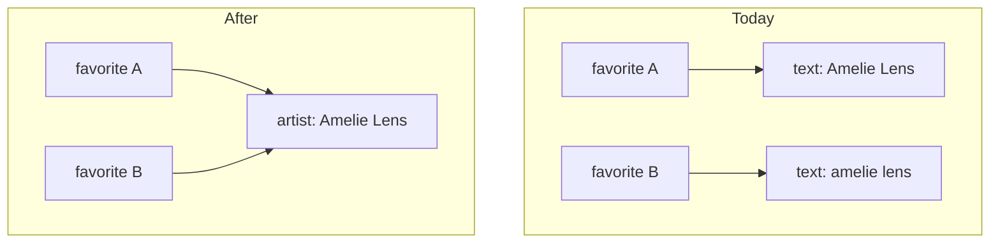

# Artist Entity - Plan

## Goal Capsule

- **Objective:** Every mix that credits the same performer points at one artist, spelling variants included, and correcting a performer's name corrects it everywhere at once.
- **Means:** Promote artists from free text copied onto each favorite into a record of their own, created inline from the artist field rather than through a management screen.
- **Product authority:** This plan owns the artist entity and the migration of existing artist names. The events and venue work that motivated it is not active scope — see How This Work Fits Together.
- **Open blockers:** None.

---

## Product Contract

### Summary

Artists become a record identified independently of their display name. Typing an unknown name in a mix's artist field creates one on the spot; typing a known name under a different casing or accent reuses the existing one. Renaming an artist rewrites every mix that credits them, and renaming onto an existing name merges the two.

### Problem Frame

An artist exists in GrooveMark only as a string copied into each favorite's `artists` array (`src/types/favorite.ts`). Nothing binds two copies of the same name together, so the app contradicts itself: the artist field suggests `amelie lens` while the user types `AMELIE`, and then stores the typed form as a separate artist because tag deduplication compares exactly (`src/components/favorites/ArtistTagsInput.vue`). The grid filter compares exactly too, so the two spellings filter to two disjoint sets of mixes (`src/stores/favoritesUi.ts`).

The cost is invisible until someone tries to use artists as an axis rather than a label. A per-artist view that gathers everything about a performer is only as trustworthy as the join it rests on, and a join on free text drifts every time a name is retyped. That drift is unrecoverable today: nothing in the app can merge two spellings after the fact.

### Requirements

**Artist identity**

- R1. An artist is a record identified independently of its display name, and a favorite references artists by that identity rather than by a copied name string.
- R2. Typing a name with no matching artist in a mix's artist field creates that artist inline. No separate screen is visited to create one.
- R3. Suggestion and matching in the artist field ignore case, accents, and surrounding whitespace.
- R4. An artist record carries a display name and nothing else.
- R5. The artist list and the grid's artist filter operate on artist identity, so filtering by an artist returns every mix crediting them regardless of how the name was typed.

**Repair**

- R6. Renaming an artist updates the name shown for every mix crediting them.
- R7. Renaming an artist onto a name that matches an existing artist under R3 merges the two into one artist, after the user confirms the merge.
- R8. An artist that no record references stops appearing in the artist list.

**Migration**

- R9. Existing artist names become artist records without user action; names matching one another under R3 collapse into a single artist whose display name is the most frequent spelling.
- R10. The migration reports nothing to the user.
- R11. The migration applies to all three places favorites are stored: the PocketBase collection, the local-mode browser store, and the per-user offline cache.

**Compatibility**

- R12. The JSON export keeps its current shape — an array of favorites carrying artist names written out in full.
- R13. Importing a file resolves each artist name to an existing artist or creates one, so a file exported before this change still imports.

**Access control**

- R14. The artists collection is readable and writable only by the account that owns the record, on create as well as on read, update and delete.
- R15. The favorites collection's create rule is scoped to its owner, closing the gap where any authenticated account can create a favorite owned by someone else.

### Data shape

### Key Decisions

- **Artists become a record rather than normalized strings.** An identity removes the ghost-artist class outright instead of making it repairable after the fact. (session-settled: user-directed — chosen over keeping names as normalized strings with a merge-and-rename tool: cleaner, and the events work will lean on this join.) Governs R1, R2, R5.
- **This work ships before the events feature, as its own plan.** Building events first would cement the current name-matching inconsistency in a second place. (session-settled: user-directed — chosen over one combined plan and over events-first.)
- **Rename is the only repair action; merge falls out of it.** One action to design, test and translate instead of three. (session-settled: user-approved — chosen over a management screen carrying separate rename, merge and orphan-delete actions.) Governs R6, R7, R8.
- **The migration merges silently.** Rename repairs anything it got wrong. (session-settled: user-directed — chosen over a first-run summary naming what merged.) Governs R9, R10.
- **An artist carries a name only.** Links, a comment and a rating are deferred, not rejected. (session-settled: user-directed — chosen over adding any of them now.) Governs R4.
- **The export stays denormalized.** Writing names out in full keeps the entity internal, leaves the format untouched, and keeps older exports importable. Governs R12, R13.
- **The favorites create rule is fixed here rather than tracked separately.** This work already writes API rules and a PocketBase migration, and leaving two collections with different rules for the same reason would be harder to reason about later. (session-settled: user-directed — chosen over opening a backlog issue and over leaving it alone.) Governs R15.

### Key Flows

- F1. Crediting an artist on a mix
  - **Trigger:** The user types into a mix's artist field.
  - **Steps:** The field suggests artists matching what has been typed, ignoring case, accents and whitespace. Accepting a suggestion credits that artist. Committing a name with no match creates an artist and credits it.
  - **Outcome:** The mix references one artist per credit, and no artist exists twice under two spellings.
  - **Covers:** R2, R3.

- F2. Repairing a misspelled artist
  - **Trigger:** The user renames an artist.
  - **Steps:** Every mix crediting that artist shows the new name. When the new name matches an existing artist under R3, the app asks whether to merge the two; on confirmation the two become one artist crediting the union of their mixes, and on refusal the rename does not happen.
  - **Outcome:** One artist, one spelling, no mix left behind.
  - **Covers:** R6, R7.

- F3. First run after the change
  - **Trigger:** The app starts against data that still stores artist names as text.
  - **Steps:** Names become artist records. Names matching one another under R3 collapse into one artist named by the most frequent spelling. The same transformation applies independently to the PocketBase collection, the local-mode browser store, and the per-user offline cache.
  - **Outcome:** The artist list holds no two entries differing only by case, accents or whitespace. Nothing is reported.
  - **Covers:** R9, R10, R11.

### Acceptance Examples

- AE1. **Covers R3.** Given an artist named `Amelie Lens`, when the user types `AMELIE LENS` into another mix's artist field and commits it, then the mix credits the existing `Amelie Lens` and no second artist is created.
- AE2. **Covers R7.** Given artists `IHateModels` and `I Hate Models`, when the user renames the first to `I Hate Models` and confirms the merge, then one artist remains and it credits the mixes of both.
- AE3. **Covers R7.** Given the same two artists, when the user is asked to confirm the merge and declines, then both artists remain and neither is renamed.
- AE4. **Covers R9.** Given three mixes crediting `Amelie Lens` and one crediting `amelie lens`, when the migration runs, then one artist named `Amelie Lens` credits all four.
- AE5. **Covers R8.** Given an artist credited by exactly one mix, when that credit is removed from the mix, then the artist no longer appears in the artist list.
- AE6. **Covers R13.** Given a JSON file exported before this change, when it is imported, then each artist name in it resolves to an existing artist or creates one, and no import error is raised for the artist field.

### Scope Boundaries

**Deferred for later**

- Links on an artist record (Instagram, SoundCloud), a free-text comment, and a rating. Named as wanted, not built here.
- Aliases — a second name pointing at the same artist without renaming it.
- A management screen listing artists with explicit merge and delete actions.

**Not addressed by this plan**

- Everything about events, venues and live performances. That work is the subject of a separate brainstorm and depends on this one.
- Reconciliation of writes made while the backend is unreachable. See Dependencies and Assumptions.

### Success Criteria

- After the migration, the artist list contains no two entries differing only by case, accents or whitespace.
- Correcting a performer's name is one action, and no mix keeps the old spelling afterwards.
- A JSON file exported before this change imports without error and without creating duplicate artists.

### Dependencies and Assumptions

- Writes made while the backend is unreachable are not reconciled today. A favorite created in that state lives only in the offline cache, and the next successful online start replaces that cache with the server's list (`src/stores/favorites.ts`). Artists created in that state inherit the same fate. This plan neither worsens nor fixes it.
- Browser storage has no migration runner, so the browser-side half of R11 has to happen on read rather than as a one-off step.
- The app ships two locales, `en` and `fr` (`src/i18n/locales/`). Any string this work introduces needs both.
- Unit tests live centrally in `src/__tests__/`, not beside the code they cover.

### Outstanding Questions

**Deferred to planning**

- OQ1. Whether artist identity is carried by a PocketBase relation or by an identifier stored on the favorite. R1 through R8 hold either way.
- OQ2. How the read-time browser migration marks itself done so it does not re-evaluate on every read.
- OQ3. Which normalization the app uses for R3, and whether the artist list's sort changes as a result.

<!-- ce-section: work-relationships -->

### How This Work Fits Together

This plan owns one area: artists as a first-class record. The breakdown below is how the surrounding work is currently understood, not a committed roadmap — a later plan may revise, split or discard it.

- **Events and live performances** — recording the nights and festivals attended, each carrying a name, a date, a venue, and the performers seen there with a score for that night's set.
  - Depends on this plan: the score is only useful next to what is already known about the performer, and that join is what this plan makes trustworthy.
  - Still to decide: the shape of that work was explored in the dialogue that produced this plan — an event as a container holding scored performances, three top-level views, and a per-artist page aggregating mix counts and starred moments alongside live scores — but none of it is settled, and it belongs to its own brainstorm.
- **Per-artist page** — one place showing everything known about a performer.
  - Depends on both this plan and the events work; it has little to show until live performances exist.
  - Can proceed independently of the events work only as a filtered list of mixes, which the artist filter already provides.

### Sources

- `src/types/favorite.ts` — `artists` is `string[]` on `Favorite`; no artist type exists.
- `src/components/favorites/ArtistTagsInput.vue` — tag deduplication compares exactly and is case-sensitive, while the suggestion list it feeds is already case-insensitive.
- `src/stores/favoritesUi.ts` — `allArtists` is derived from the favorites' arrays into a `Set`, and the grid filter compares artist names exactly.
- `src/services/favoritesRepository.ts`, `src/services/storage.ts` — the active-plus-cache repository pair and the two storage keys, `groovemark:favorites:local` and `groovemark:favorites:google:<userId>`.
- `src/stores/favorites.ts` — the export writes the favorites array directly, and a successful online start replaces the cache with the server's list.
- `src/services/favoriteImport.ts` — the import validates that the root is an array and that each entry has a string `id` and `url`; nothing else.
- `pb_migrations/1764995000_add_user_to_favorites.js`, `pb_migrations/1765062331_updated_favorites.js` — the owner relation, the owner-scoped rules for list, view, update and delete, and the create rule left unscoped.
- `docs/reference/pocketbase-schema.md`, `docs/explanation/architecture.md` — the documented collection contract and the persistence rules this plan has to keep true.
