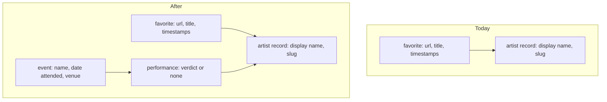
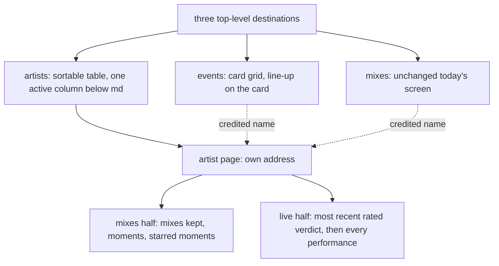
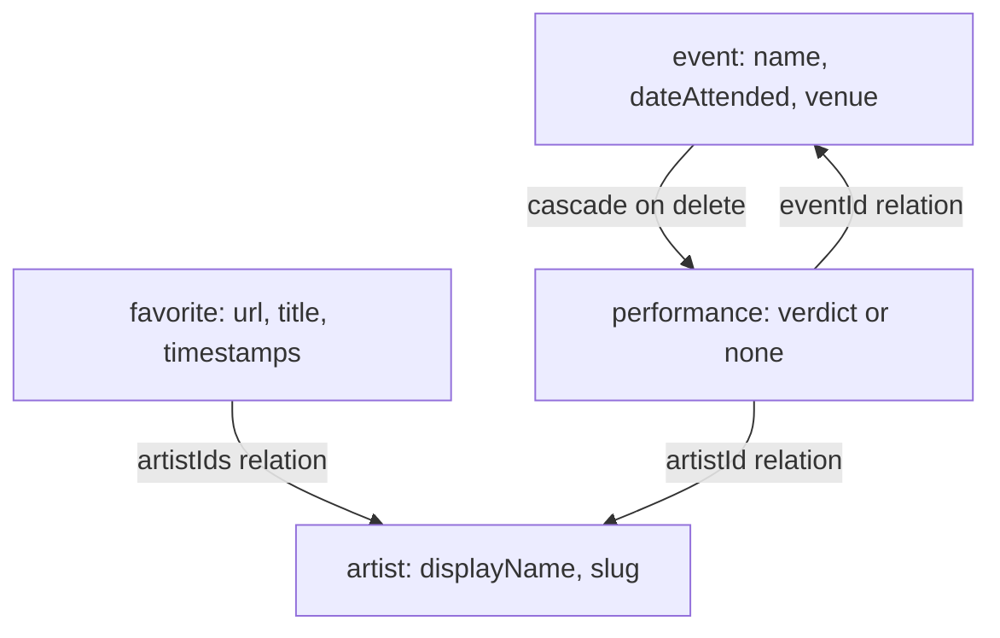
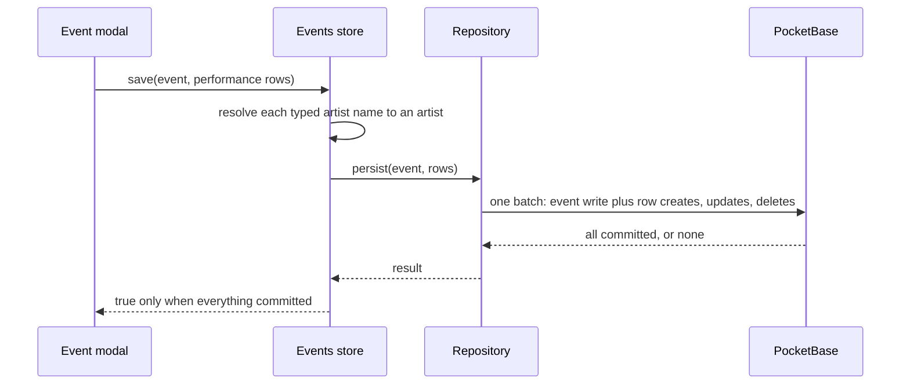
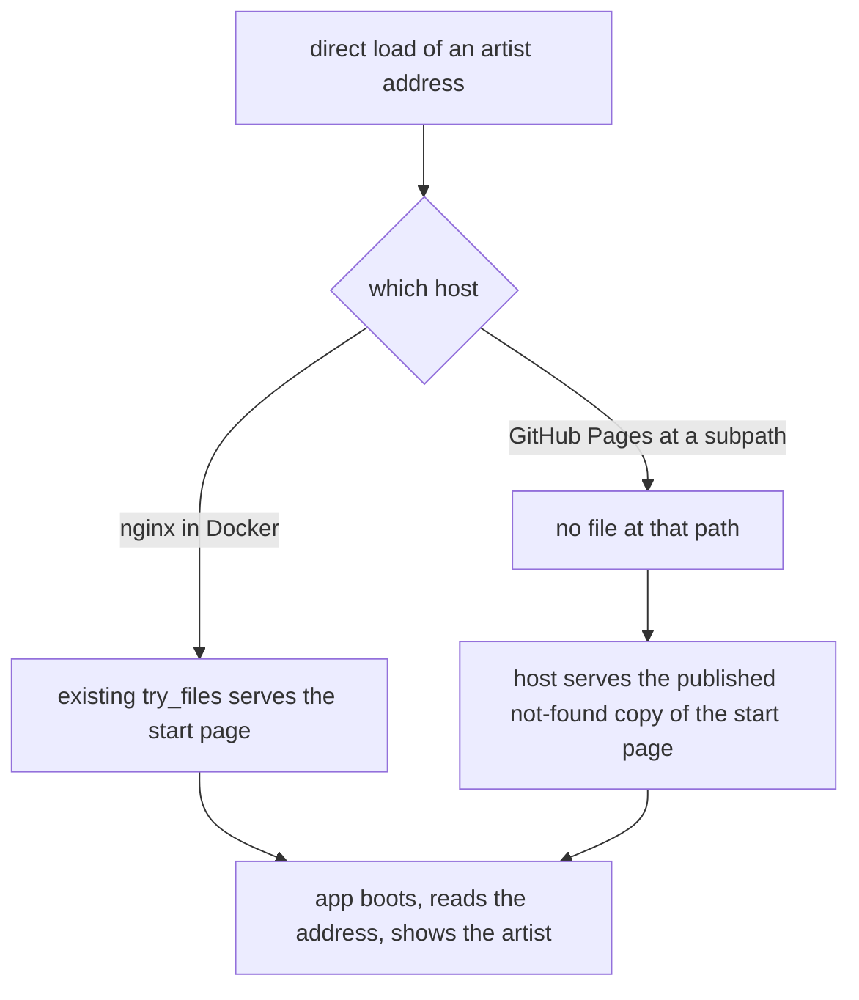

# Events and Artist Page - Plan

## Goal Capsule

- **Objective:** The operator can answer "who did I see that night" and "is this performer worth seeing again" inside GrooveMark, instead of reading a spreadsheet row and then searching the app by hand.
- **Means:** Record a night out as an event, and each performer seen there as a performance record carrying a four-step verdict, then give every artist a page that puts their bookmarked mixes beside their live history (KTD1).
- **Product authority:** This plan owns events, performances and their verdict, the events tab, the artists tab, the artist page, and the first navigation the app has. Renaming, merging and deleting artists are not active scope — see How This Work Fits Together.
- **Execution profile:** Cross-cutting. Two new collections, one new repository pair, two new stores, the app's first router, two new destinations plus one addressable page, a transactional write path that a migration provisions, the app's first cascading delete, and a change to the export format. Ships behind no flag.
- **Stop conditions:** Stop and ask if a requirement here would need artist repair -- renaming or merging -- to exist, if the export has to keep reading files in the old shape after all, or if the batch write path turns out to be unavailable on the pinned server, since KTD2's atomicity rests on it.
- **Tail ownership:** This plan ends at a green branch. Commit, PR and CI belong to whoever runs the shipping step.

---

## Product Contract

### Summary

A night out becomes a record of its own — a name, a date, a venue, and the performers seen there, each carrying a verdict from dislike to three stars. The app grows three top-level destinations, and every artist gets a page that brings their bookmarked mixes together with their live history under one heading.

### Problem Frame

The operator already tracks live performances, outside the app, in a table with one row per performer per night: artist, score, date, event, venue. GrooveMark holds the other half of the same interest — the mixes bookmarked from those same performers — and the two halves never meet.

The cost lands on the second of the two questions rather than the first. Retrieving who played on a given night is a lookup the spreadsheet already answers. Judging a performer over time is the part that needs both halves at once: how many of their mixes were kept, how many moments in them were starred, and how the last live sets actually went. Today that means reading a row, then searching the app by name, and reconciling the two by eye.

Nothing in the app carries the live half. No event, venue, date-attended or performance-score concept exists in `src/` or `pocketbase/pb_migrations/`, and `Timestamp.rated` is the only score-like field anywhere (`src/types/favorite.ts:1-5`). The app also has no navigation at all: `src/App.vue` renders a single shell gated on `appStore.status`, and `vue-router` is absent from `package.json`. The two destinations this work needs are the first the app has ever had.

The operator will retype the existing table by hand rather than importing it, so entry and revision ergonomics decide whether the feature gets populated at all.

### Data shape

An event fans into the same artist records that favorites already reference, so the join the artist page rests on is identity, not a name string.

### Requirements

**Events and performances**

- R1. An event is a record carrying a name, a date attended and a venue, and it holds the performances the operator saw there.
- R2. A performance credits exactly one artist and carries at most one verdict. It exists as part of its event and nowhere else.
- R3. A verdict is one of four ordered values — dislike, one star, two stars, three stars. No numeric score and no fifth value exist.
- R4. A performance may carry no verdict, and an unrated performance still records that the operator saw that artist at that event.
- R5. A performance credits an artist by identity, and committing a name with no match creates that artist inline exactly as a mix's artist field does.
- R6. The event name and the venue are free text, each suggesting values already used by earlier events.
- R7. An event holding no performance is valid and appears in the events tab.
- R8. Creating an event and adding, editing or removing all of its performances happen on one surface, and the event saves or fails as a whole. An existing event is reopened from its card in the events tab and revised on that same surface -- its name, date attended, venue and performances alike.
- R26. An event can be deleted from the events tab, and the deletion is confirmed before it happens, stating how many performances it removes. Deleting an event removes those performances and no artist record.

**The events tab**

- R9. The events tab renders one card per event, in a grid following the same column progression as the mixes grid — one column below `md`, then fixed-width columns as width allows.
- R10. An event card shows the event's name, date and venue, then every performance it holds with the credited artist and that performance's verdict.
- R11. Events are ordered by date attended, most recent first.
- R27. The events tab offers a text search over the event name and the venue, so a night attended long ago is retrieved without scrolling the whole grid.

**The artist page**

- R12. Every artist has a page, reachable from three surfaces: the artists tab, a credited name on a mix card, and a credited name on an event card. The artist name in the mixes sidebar stays a filter control and does not link, per R20 -- one element cannot both filter the grid and navigate away from it.
- R13. The artist page shows the mixes crediting that artist together with three counts: mixes kept, moments across those mixes, and starred moments among them.
- R14. The artist page leads its live half with the verdict of the most recent rated performance and the date of that performance, then lists every performance from most recent to oldest with its event, date, venue and verdict.
- R15. An artist with no mix, or with no performance, shows that half as empty rather than omitting it.

**The artists tab**

- R16. The artists tab lists every artist credited by at least one mix or one performance. An artist nothing credits does not appear.
- R17. From `md` up, the artists tab is a table sortable by any of its columns: artist, mixes, moments, starred moments, performances, most recent verdict, and date last seen. Its most-recent-verdict column shows the latest performance's verdict as it stands, marking it unrated when it is, which differs deliberately from R14's leading summary.
- R18. Below `md`, the artists tab shows each artist's name and the value of the active sort column only, and changing the sort changes which value is shown.
- R19. The artists tab offers a text search over artist names.

**Navigation**

- R20. The app has three top-level destinations — mixes, events, artists — and the mixes destination keeps the layout, grid, sidebar artist filter, search and sort it has today. Its import and export controls stay in place, carrying the format R22 to R24 define.
- R21. The artist page has an address of its own, so it can be reopened directly and shared. Events have no address of their own.

**Backup and portability**

- R22. One JSON export carries both mixes and events, and one import restores both from that file. The file is an envelope carrying an integer format version and one top-level key per domain, so what the file is can be read off it rather than inferred from its shape.
- R23. The import reads only the new format, recognized by that version, and rejects any file carrying no recognized version -- the previous bare-array shape among them -- rather than reading it partially. The rejection names the expected envelope, so an older file can be brought forward by hand.
- R24. Events in the export credit artists by name rather than by internal identity, so an export restores onto a different account or instance.

**Access control**

- R25. The events collection is readable and writable only by the account owning the record — on create as well as read, update and delete — and rejects an owner submitted by anyone else.

### Destinations and regions

### Key Decisions

- **A night out is a record holding its performances, rather than one row per performer.** A mistyped venue cannot split one night into two, and the date and venue are corrected in a single place. (session-settled: user-directed — chosen over a flat performance row grouped at display time, and over merging mixes and live sets into one object: fewer keystrokes per festival and one place to fix a night.) Governs R1, R2.
- **The verdict is a four-step ordinal ending in a dislike, not a number.** It answers "would I go back", which is not a quantity worth averaging. (session-settled: user-directed — chosen over an integer out of ten, five stars, and a decimal out of ten.) Governs R3, R14.
- **A verdict is optional.** Recording who played is worth keeping even with no opinion to attach. (session-settled: user-directed — chosen over requiring one on every performance: a performer caught for three minutes would otherwise go unrecorded, defeating the first of the two goals.) Governs R4, R14.
- **The artist page leads on the most recent rated performance, not simply the most recent one.** An unrated latest night would otherwise silence the summary exactly when it is being consulted. The artists tab's column deliberately does the opposite and reports the latest verdict as it stands. Governs R14, R17.
- **One surface creates and revises a whole event.** Retuning every verdict across a line-up at once matters more than the fastest first capture. (session-settled: user-directed — chosen over a keyboard-stacking field on a dedicated event page, and over entering all names first and attaching verdicts in a second pass.) Governs R8, R21.
- **Events render as cards in the mixes grid, not as a full-width list.** Below `md` that grid is already a single column, so a phone gets the full-width reading either way. (session-settled: user-directed — chosen over a full-width chronological list and a year-grouped timeline.) Governs R9, R10.
- **The artists tab catalogues performers seen only live alongside bookmarked ones.** (session-settled: user-directed — chosen over listing only artists holding a mix, and over listing everything behind a default has-a-mix filter: retrieving a performer seen once is the first of the two goals.) Governs R16.
- **The artists tab is a sortable table above `md`, and a name-plus-active-column list below it.** Sorting is what turns a catalogue into an answer to "is this performer worth seeing again". (session-settled: user-directed — chosen over a dense list, a card grid, a two-tier row, an expandable row, and a horizontally scrolling table.) Governs R17, R18.
- **The export becomes one file in a new shape, with no backward compatibility.** An older file is brought forward by wrapping its array under the mixes key and adding the format version, which the operator can do by hand once and which R23's rejection message names. (session-settled: user-directed — chosen over two separate export files, over leaving events out of the export, and over an import reading both shapes.) Governs R22, R23. This supersedes R12 of [the artist entity plan](2026-09-05-2309-feat-artist-entity-plan.md), which pinned the export to its bare-array shape.
- **The venue stays free text with suggestions, not a record.** A misspelled venue costs only a duplicate suggestion, where a misspelled artist would have split a join. Governs R6.
- **Events belong to one account, scoped exactly like favorites and artists.** Governs R25.

### Key Flows

- F1. Recording a night out
  - **Trigger:** The operator opens the events tab and starts a new event.
  - **Steps:** The event's name and venue suggest values used by earlier events, and the date is entered. Each performer seen is added as a performance whose artist field suggests known artists and creates an unknown one on commit. A verdict is attached to a performance or left off. The whole event is saved in one action.
  - **Outcome:** One event holds every performance the operator recorded for that night, and every credited performer resolves to an artist record.
  - **Covers:** R1, R4, R5, R6, R8.

- F2. Deciding whether to see a performer again
  - **Trigger:** The operator opens the artists tab and sorts it, or opens a performer's page from a credited name.
  - **Steps:** The table is sorted by the column that matters — starred moments, performances, most recent verdict. Opening a performer shows the mixes half with its three counts, and the live half led by the most recent rated verdict and its date, followed by every performance.
  - **Outcome:** Both halves of what is known about the performer are readable on one page, without leaving the app.
  - **Covers:** R13, R14, R17.

- F3. Restoring from a backup
  - **Trigger:** The operator imports a JSON file.
  - **Steps:** A file in the previous bare-array shape is rejected outright. A file in the new shape restores mixes and events together, resolving each artist name it carries to an existing artist or creating one.
  - **Outcome:** Mixes and events are both restored, and no artist exists twice under two spellings within the imported set.
  - **Covers:** R22, R23, R24.

### Acceptance Examples

- AE1. **Covers R4, R14.** Given a performer whose most recent performance carries no verdict and whose previous one carries two stars, when their page is opened, then the live half leads with two stars and the date of that earlier performance, not with an unrated summary.
- AE2. **Covers R4.** Given an event being saved, when one of its performances has no verdict selected, then the event saves and that performance is listed with the artist credited and no verdict shown.
- AE3. **Covers R14, R15.** Given a performer with performances but none of them rated, when their page is opened, then the live half shows no leading verdict and still lists every performance.
- AE4. **Covers R16.** Given a performer credited by one performance and no mix, when the artists tab is opened, then that performer is listed with no mix count and their performance count.
- AE5. **Covers R16.** Given a performer credited only by one event, when that event is deleted, then the performer no longer appears in the artists tab.
- AE6. **Covers R5.** Given a performance's artist field, when the operator commits a name matching an existing artist under a different casing or accent, then the performance credits the existing artist and no second artist is created.
- AE7. **Covers R5.** Given a performance's artist field, when the operator commits a name that is empty once trimmed, then no artist is created and no performance is added.
- AE8. **Covers R8.** Given an event whose save fails, when the failure surfaces, then none of its performances are persisted and the operator's entered values are still on screen.
- AE9. **Covers R18.** Given the artists tab below `md` sorted by starred moments, when the operator changes the sort to most recent verdict, then each row's shown value changes from starred moments to that performer's most recent verdict.
- AE10. **Covers R23.** Given a JSON file exported before this change, when it is imported, then the import is rejected with the format named and nothing in the app changes.
- AE11. **Covers R24.** Given an export taken on one account, when it is imported on a different account, then every event's performances credit artists resolved on that account rather than failing on unknown identities.
- AE12. **Covers R21.** Given an artist page opened from a credited name, when its address is reopened in a new tab, then the same performer's page is shown.
- AE13. **Covers R20.** Given the mixes destination, when this work has shipped, then its grid, sidebar artist filter, search and sort behave as they do today.
- AE14. **Covers R17.** Given a performer whose latest performance is unrated and whose previous one carries two stars, when the artists tab is sorted by most recent verdict, then their row reports the latest performance as unrated, while their page still leads with two stars per R14.
- AE15. **Covers R11.** Given events attended in three different years, when the events tab is opened, then the most recently attended event appears first.
- AE16. **Covers R26.** Given an event holding four performances, when the operator deletes it, then a confirmation names the four performances it removes, and dismissing that confirmation leaves the event and all four intact.
- AE18. **Covers R27.** Given events spanning three years, when the operator searches for part of a venue name, then only the events held at that venue remain in the grid, and clearing the search restores the full date-ordered list.
- AE17. **Covers R8.** Given a saved event whose venue was mistyped, when the operator reopens it from its card, then every field and every performance it holds is presented for revision, and correcting the venue leaves its performances untouched.

### Scope Boundaries

**Deferred for later**

- Renaming an artist, and the merge that falls out of renaming onto an existing name. Both were considered for this plan and moved out of it.
- Deleting artist records that nothing references. R16 hides them from the artists tab; the collection still grows monotonically.
- A rating or a like at the level of a whole mix. R13's counts aggregate what already exists instead.
- An event's own rating, its price, who came along, and photographs.
- A dedicated CSV import, and any importer that maps the operator's existing spreadsheet columns.
- An address of its own for an event.

**Accepted limitations**

- The mixes sidebar answers "this artist's mixes" by filtering the grid, and the artist page answers it on its own surface. Both read the same per-artist derivation (KTD16), so the two cannot disagree on a count, but the sidebar stays a filter rather than becoming a second route to the page.
- Two spellings of the same performer created independently stay two artists until the deferred merge ships. This plan adds a second place where a name is typed, so it widens that exposure without changing the mechanism.
- A performer whose name was mistyped once stays suggestible in both artist fields, because suggestions are drawn from every loaded artist while R16 only hides uncredited ones from the artists tab. This carries forward from [the artist entity plan](2026-09-05-2309-feat-artist-entity-plan.md).
- The operator's existing table is retyped by hand. Nothing in this plan shortens that pass beyond the suggestions in R6 and the single-surface entry in R8.
- The same performer playing twice on the same night is recorded as two performances of the same event, with no notion that they are one billing split across two sets.
- Events recorded in local mode do not follow the operator into a signed-in account. Local-mode storage and the authenticated cache are deliberately separate keys with no migration between them (`src/services/storage.ts`, `AGENTS.md`), and events inherit that exactly as favorites already do. The export in R22 is the bridge.

**Not addressed by this plan**

- Reconciliation of writes made while the backend is unreachable. The authenticated offline path is read-only by design, and reconnecting treats the server list as the source of truth (`docs/explanation/architecture.md`); this plan neither widens nor closes that.
- A full festival line-up as published, as opposed to the performances the operator actually saw.
- Any change to how a mix credits its artists.

### Success Criteria

- A festival night with ten performers is entered without retyping its name, date or venue for each one.
- Opening a performer's page answers whether to see them again from that page alone, with no cross-referencing.
- A night attended a year ago is found in the events tab by searching its venue, and its line-up is read without leaving the app.
- A performer seen once and never bookmarked is found from the artists tab, by name search or by sorting on date last seen.
- An export taken after this ships restores both mixes and events onto an empty account, and every performance's artist is credited.
- The mixes destination reads and behaves as it does today, apart from the navigation it gains and the export format R22 to R24 define.

<!-- ce-section: work-relationships -->

### How This Work Fits Together

This plan owns one area: events, and the artist page that joins them to mixes. The breakdown below is how the surrounding work is currently understood, not a committed roadmap — a later plan may revise, split or discard it.

- **Artists as a first-class record** — shipped, in [the artist entity plan](2026-09-05-2309-feat-artist-entity-plan.md) and recorded in [ADR-0002](../decisions/0002-artists-as-a-first-class-record.md).
  - This plan depends on it: a performance credits an artist by identity (R5), which is what makes the artist page's join trustworthy.
  - This plan supersedes its R12: the export no longer keeps its bare-array shape.
- **Artist repair** — renaming an artist, merging two spellings, and removing a record nothing credits.
  - Depends on this plan for the artist page, which is where a rename belongs.
  - Enables the removal of the two accepted limitations above about diverging spellings.
  - Still to decide: whether a rename rewrites the derived name mirror on every crediting record, and what a merge does to performances as well as favorites.
- **Venues as records** — grouping nights by place, with a place corrected in one location.
  - Can proceed independently of this plan; R6 keeps the venue as free text with suggestions.
  - Still to decide: whether the operator wants a venue axis at all, which this plan does not establish.

### Dependencies / Assumptions

- The artist entity, its inline creation from an artist field, and its owner-scoped collection with a unique index on account and slug are in place (`src/types/artist.ts`, `pocketbase/pb_migrations/`). This plan builds on them and does not restate them.
- Artist matching already ignores case, accents and surrounding whitespace (`src/utils/artist.ts`). R5 inherits that behaviour rather than defining its own.
- An event holding no performance is allowed rather than rejected — an agent inference, not a stated preference. R7 owns the rule; overturning it changes R7 and adds a validation state to R8.
- The mixes grid is a single column below `md` and fixed-width columns above it (`src/assets/tailwind.css`). R9 rests on that and needs no token of its own; the artists table is a different shape and brings its own, per KTD9.
- Only the operator's own account uses the app, so no requirement here concerns concurrent editing by two people.

### Outstanding Questions

**Resolve Before Planning**

- None.

**Deferred to Implementation**

- Whether the single-value artist field for a performance is a bound added to the existing tag input or a sibling component reusing its suggestion and commit behaviour. Either satisfies R5. Planning's recommendation is a mode on the existing component: `src/components/favorites/ArtistTagsInput.vue` is not a thin wrapper — it carries arrow-key navigation, commit-on-Tab, click-outside handling, normalized dedup and suggestion ranking — and a sibling would re-implement all of it (U14).
- The date input control used for a date attended. R1 and KTD10 fix that it is required and client-settable; the control itself is a UI detail.
- Whether the events grid needs the progressive rendering the mixes grid has. U7 decides and records it; planning's reading is that it does not, because that mechanism answers a measured hundred-plus-card problem that an events list will not reach.

The five questions this document deferred to planning are answered above: performances as their own records (KTD1), the artist credit carrying both a relation and a display name (KTD1, KTD3), the router's history mode and how it composes with the boot state machine (KTD4, U6), per-artist aggregation derived in memory (KTD12), and the date attended being required (KTD10).

### Sources

- `src/types/favorite.ts:1-17` — `Timestamp.rated` is the only score-like field; `Favorite` carries both `artists` names and `artistIds`.
- `src/types/artist.ts` — an artist record carries a display name and a slug.
- `src/utils/artist.ts` — name normalization and the resolve-or-create helper this plan's R5 inherits.
- `src/services/artistsRepository.ts` — the repository exposes list, create, find-by-slug and a batch create, and no rename, update, delete or merge. This is why artist repair is a separate area, not an omission.
- `src/stores/favoritesUi.ts` — the artist list is derived from the artists credited by favorites, and the grid filter matches on identity while the search box matches on names. R16 extends that derivation to performances.
- `src/stores/favorites.ts` — the export payload and the import loop's artist resolution, both of which R22 to R24 change.
- `src/services/favoriteImport.ts` — the current import validation, which R23 replaces.
- `src/App.vue`, `src/components/layout/HeaderBar.vue`, `package.json` — no router and no navigation affordance exist today.
- `src/assets/tailwind.css` — the layout tokens, semantic layout classes and the custom breakpoints R9 and R17 depend on.
- `pocketbase/pb_migrations/` — the tracked schema migrations, including the owner-scoped rules and unique index R25 mirrors.
- `docs/reference/pocketbase-schema.md`, `docs/explanation/architecture.md` — the collection contract and the persistence rules this plan must keep true.
- `docs/reference/responsive-layout.md`, `docs/conventions/frontend-layout.md` — the layout contract R9, R17 and R18 must not break.
- `AGENTS.md` — the store-responsibility split this plan must not break.

---

## Planning Contract

### Product Contract preservation

Every requirement and Key Decision above carries the meaning and the ID it had at requirements time. R2's "exists as part of its event and nowhere else" is now enforced by the database rather than by document structure (KTD1), and R8's whole-or-nothing save is honoured by a server transaction rather than by a single-record write (KTD2) -- both are mechanism changes under the same product rule.

One rule was **added** during planning review rather than restated: **R26**, with **AE16**. AE5 already assumed an event could be deleted, and KTD1 built the cascade that makes the deletion destructive beyond the record the operator can see, but no requirement placed an affordance or a confirmation in front of it. That is a product rule, so it is recorded as one instead of appearing only in a unit. Its shape follows what the app already does for a single mix (`src/stores/favorites.ts:476-484`), with the performance count added because the operator cannot see the rows individually.

**R27** was **added** during the same review, with **AE18**, at the user's direction rather than on a reviewer's recommendation (session-settled: user-directed -- chosen over recording the absence of a search as an accepted limitation: the first of the two goals had no retrieval path and no success criterion, and date ordering alone was judged not to answer it). It grows this plan's scope by one requirement and one surface, and the Success Criteria gained the matching bar.

**R8** was **extended** in the same review, with **AE17**. It described creation only, while the settled one-surface decision and this plan's own units both assume revision -- so an event could be created and deleted with no stated way back into it to fix a mistyped venue. The sentence added states the reopening that everything downstream already relied on.

### Key Technical Decisions

- KTD1. **An event and its performances are two owner-scoped collections, not one record with a nested array.** A performance references its event and its artist by single-value relation, and the event relation cascades on delete. (session-settled: user-directed — chosen over storing performances as a JSON array on the event record: a normalized schema with real referential integrity, and deleting an event removes its performances without cleanup code.) Governs R1, R2, R25.
- KTD2. **The event and all of its performance rows are written in one PocketBase batch transaction.** The endpoint is disabled by default, so a settings migration enables it and writes its two bounds -- a request count of 50 and a transaction timeout of 3 seconds -- which keeps the setting reproducible in the Docker image instead of a manual dashboard step. (session-settled: user-approved -- chosen over sequential writes with a compensating delete of the event when a row create fails: the compensating delete can itself fail, and what it leaves behind is an event with a partial line-up, which is exactly what R8 forbids.) Two mechanisms hang off the bounds. The repository refuses to send a batch larger than the configured request count, raising its own error rather than receiving an opaque rejection. And a rejection caused by the endpoint being disabled maps to its own error code and message naming the unapplied migration, because that failure is otherwise indistinguishable from any other write failure -- see the Risks section for why it presents so poorly. Governs R8.
- KTD3. **Local mode and the offline cache store an event's performances nested under the event, in one storage key.** Three consequences follow, and the interface owns all three so that no caller branches on mode. The local repository's replace-all takes whole events and does the nesting itself, so no store, export or import path ever sees a performance row -- which is what makes KTD3 hold at the cache mirror, the one caller where the cloud path has two normalized collections in hand and the local path needs one nested shape. The interface fixes the within-event order of performances as entry order, so a line-up reads as it was typed; local storage gives that for free, and the cloud repository has to sort explicitly to reproduce it, since the pattern it follows calls the list endpoint with no sort (`src/services/pocketbaseArtistsRepository.ts:25`). And atomicity in local mode rests on the single-key write, not on a queue: only `LocalArtistsRepository` serializes writes (`src/services/localArtistsRepository.ts:13-26`); `LocalFavoritesRepository` does not, and the underlying write swallows its failures (`src/services/storage.ts:98-104`), so the events repository adopts the queue deliberately and the swallowed-failure exposure is carried in the Risks section rather than assumed away.
- KTD4. **The router uses HTML5 history with the base the build injects.** That keeps the Pages build at its subpath and the Docker build at the root working from one source, without moving the base into the Vite config where it would break the Docker build. A copy of the start page is published under the host's not-found name so a direct hit on an artist address resolves. (session-settled: user-approved — chosen over hash history: no fragment in a shared artist address, at the cost of one publication step.) Governs R21.
- KTD5. **The events repository pair joins the existing single repository-selection call.** What one call buys is precise: one storage-key scope and one initial mode decision for the whole session. It does not prevent later divergence, and the plan should not claim it does -- the favorites store already rewrites its own mode to cache after a failed load (`src/stores/favorites.ts:326-329`) and the artists store already swaps its active repository without touching the selection it was handed (`src/stores/artists.ts:64-71`). (session-settled: user-approved -- chosen over resolving the new pair separately: a second selection call is a second chance to disagree about which user's keys are in scope.) The consequence of the divergence one call does not prevent is KTD6's.
- KTD6. **Read-only-when-degraded moves from the favorites store to the app store, and is widened as it moves.** (session-settled: user-approved — chosen over duplicating the guard in the events store: two independent switches could disagree and accept an offline event write that is then discarded on reconnect.) Moving it as-is would lose coverage rather than gain it. Today the favorites store reads two inputs, only one of which is a load-failure flag (`src/stores/favorites.ts:289`), and the flag the app store sets is fed by artists alone (`src/stores/app.ts:45`) while the favorites store's own fallback to cache is invisible to it. A single switch fed only the app store's current input would make a session writable in which the mixes half is already a stale snapshot. So the moved switch is the disjunction of every domain's load-failure flag **and** every domain's effective post-fallback mode: each store reports the mode it is actually running in upward, and the app store decides.
- KTD7. **A new events domain store owns events and their performances; new UI stores own each new tab's own sort and search.** The project's store-responsibility split forbids any of it in the favorites stores, and neither new search may share the ref that filters the mixes grid -- three independent search boxes now exist. So an artists-UI store owns the artists table's sort and search, and an events-UI store owns the events tab's search, each mirroring how the mixes stores already separate domain data from view state. Governs R17, R18, R19, R27.
- KTD8. **The card-grid column progression is renamed to a neutral semantic class that the mixes and events grids both use.** (session-settled: user-approved — chosen over reusing the favorites-named class on the events grid, and over duplicating its rules: one owner keeps the two grids in step when a breakpoint changes.) Governs R9.
- KTD9. **The artists table gets its own layout tokens and semantic classes.** The existing tokens are computed from sidebar width plus gaps plus a fixed card width, which does not describe a table that collapses to one value column. Governs R17, R18.
- KTD10. **A date attended is a required client-settable date field.** (session-settled: user-approved — chosen over allowing a blank date: the events tab is ordered by it and the artist page prints it beside the verdict.) Governs R1, R11.
- KTD11. **Both new relations are declared single-select with an explicit `maxSelect: 1`, and the migration test asserts that exact value.** A relation left at `0` is single-select rather than unlimited, and the failure is silent -- see `docs/journal/solutions/database-issues/pocketbase-maxselect-single-select.md`.
- KTD12. **Events and performances load at session start, and per-artist aggregation is derived in memory.** (session-settled: user-approved -- chosen over querying per artist when a page or a column is opened: the artists table sorts on aggregates over every artist at once, so a per-artist query path would fan out to one request per row for the sort alone.) This matches how the artist list and per-artist counts are already derived from loaded favorites. Governs R13, R14, R16, R17.
- KTD13. **Record ids are minted client-side, in PocketBase's own id shape, by one helper both modes use.** KTD2 depends on it: a batch is an array the client builds and sends together, so no request in it can reference an id the server would generate for an earlier request. Every performance row's event reference must therefore already be known when the batch is sent, which means the client mints the event's id. PocketBase constrains that id to exactly fifteen characters matching `^[a-z0-9]+$` (`pocketbase/pb_migrations/1788815913_created_artists.js:9-22`), so `crypto.randomUUID()` -- what both local repositories use today (`src/services/localArtistsRepository.ts:46`, `src/services/localFavoritesRepository.ts:53`) -- is rejected on both length and pattern. One helper serves every mode so an id has one shape everywhere. Without this, KTD2 quietly degrades into two round trips and R8 goes unmet. Governs R8.
- KTD14. **An artist's address is keyed on the artist's slug, not on the record id.** R21 asks for an address that can be reopened and shared, and a record id is opaque, per-account and per-instance -- which is [ADR-0002](../decisions/0002-artists-as-a-first-class-record.md)'s own reasoning and the reason the export already drops artist ids (`src/stores/favorites.ts:252-255`). A slug survives a different account and a re-import; a find-by-slug lookup already exists (`src/services/artistsRepository.ts:11`). What the code calls a slug is a folded display name, not a URL token -- normalization strips diacritics and case and collapses inner whitespace, leaving `/`, `#`, `?` and spaces intact -- so the address carries the slug **percent-encoded**, and every link to an artist page is built from the named route with a slug parameter rather than by string concatenation. `AC/DC` is the case that decides it: concatenated, its address never matches the route. The cost is that the deferred rename will break addresses shared before it, which is why the not-found state is a documented behaviour rather than an edge case. Governs R21.
- KTD15. **Only the event relation cascades, and a performance's owner is a denormalized copy that the rules must guard.** `artistId` is declared `cascadeDelete: false`, matching every relation the schema already has, so an artist record outlives the performances crediting it -- which is consistent with there being no artist delete anywhere in the app (`src/services/artistsRepository.ts:8-19`) and with R16 hiding uncredited artists instead of removing them. The event relation is the schema's first cascading relation, so its value is asserted in the migration test on the same exact-value discipline KTD11 applies to `maxSelect`. Separately, the owner-scoped rules validate a record's own `owner` field and not its relations, so nothing in the rules as inherited stops a performance owned by the caller from pointing at another account's event or artist. U2 adds the relation guard to the performances create and update rules and records it in the schema reference; with one operator the exposure is data integrity rather than disclosure, but a row whose owner disagrees with its event's is visible-but-orphaned while the cascade still deletes it. The expression is pinned rather than left to the implementer, because getting it wrong fails closed: a guard that never evaluates rejects **every** event save, presenting as the least diagnostic failure in the app (see the Risks section). The intended form is a collection lookup correlating the submitted id with the caller -- `@collection.events.id ?= @request.body.eventId && @collection.events.owner ?= @request.auth.id`, and the same shape against the artists collection for `artistId` -- rather than a traversal of the submitted relation (`@request.body.eventId.owner`), which PocketBase's rule language does not document. Both relations are guarded: the artist relation does not cascade, so an out-of-account credit leaves a wrong reference rather than a deletion, which nothing else in the schema or the suite would surface. Two things about it are unproven on the pinned server and only a live check can settle them: whether the correlation holds on one row rather than matching across the collection, and whether the lookup can see an event created by an earlier request of the **same** batch, which KTD2's transaction requires. U2's verification is where both are decided; if neither form evaluates, the recorded fallback is that a performance's `owner` is a denormalized copy of its event's that nothing enforces, written into the schema reference as an accepted limitation rather than left implied. Governs R2, R25, R26.
- KTD16. **Per-artist aggregation and verdict rendering each have exactly one owner.** R13 (one artist) and R17 (every artist, for sorting) need the same three mix-side numbers -- mixes kept, moments, starred moments -- and the store that already computes one per-artist reduction is `src/stores/favoritesUi.ts:56-64`. That computed becomes one per-artist aggregate map that both the artist page and the artists table consume, rather than each deriving the same arithmetic over the same source. On the performance side the split already has owners: U1 holds the pure selectors and U4 exposes the per-artist performance view. A verdict is rendered on four surfaces -- the event card, the event modal, the artist page and the artists table -- so one display component serves the three read-only surfaces and one editable control serves the modal, both reading U1's ordering and labels. At one call site the repo inlines such a marker (`FavoriteCard.vue`'s rated star); at four it drifts, and AE14 depends on two of those surfaces differing deliberately. Governs R13, R17.
- KTD17. **A performance's artist name resolves an artist, but does not vote in the display-name election unless the artist is live-only.** The import elects an artist's spelling by frequency first (`src/utils/artist.ts:32-49`). Left alone, that has two wrong branches: if performance names vote, four lowercase spellings across events rename an artist whose mixes spell it properly; if they are excluded from resolution altogether, an artist seen only live never resolves at all. So they resolve like any name -- normalized, matching an existing artist under any casing or accent per R5 -- and the election over spellings runs on mix-side names when the artist has any, and on performance names when it has none. The election decides the spelling only for an artist the file creates: an artist already present on the target account keeps the display name it has, which is the rule [the artist entity plan](2026-09-05-2309-feat-artist-entity-plan.md) shipped. Governs R24.

### High-Level Technical Design

The data model, with the two new collections beside the two that exist:

The whole-or-nothing save (KTD2), against the cloud repository:

Resolving a direct hit on an artist address, across the two deploy targets (KTD4):

### System-Wide Impact

**Data lifecycle and deletion.** Two lifecycles arrive that had no precedent. A performance's lifetime is bounded by its event: the event relation cascades at the database level, so deleting an event removes its rows without application code and without passing the delete rule (KTD1). Nothing else cascades (KTD15), so an artist record outlives every performance crediting it -- consistent with the app having no artist delete at all, which is also why the artists collection grows monotonically and R16 hides uncredited artists rather than removing them. Deleting an event is the first destructive operation in the app that removes more than one record, and the records it removes are ones the operator cannot address individually. That is why R26 exists as a product rule and why AE16 pins the count in the confirmation.

**Ownership and access boundaries.** Both collections repeat the four owner-scoped rules and the create-owner guard the artists collection established (`pocketbase/pb_migrations/1788815913_created_artists.js:5-6,70-76`), so read scope is unchanged in kind. What is new is a child row carrying its own `owner` copy rather than deriving visibility from its parent, and the inherited rules validate `owner` without constraining the relations -- so a row's visibility and its parent's can disagree while the cascade still applies to it. KTD15 closes that with a relation guard. With one operator this is a data-integrity exposure, not a disclosure one.

**Persistence and offline posture.** Two storage keys join the scoped set -- one for local mode, one per authenticated user -- under the naming rule `AGENTS.md` fixes, and the retired shared `favorites` key stays retired. The repository selection call becomes a three-domain call, which widens its single throw surface: a missing user id still aborts every domain's load before any of them runs. The offline posture itself does not change -- the authenticated cache stays read-only with no write queue -- but the read-only _decision_ changes owner, and KTD6 widens its inputs as it moves, because moving it unchanged would make more of the app writable than today. The cache mirror gains a shape transform, since the cloud path holds two normalized collections where the local path needs one nested shape; KTD3 puts that inside the local repository so no store sees a performance row. Bootstrap gains a third parallel participant, and a rejection there does not degrade the session -- it signs the operator out (`src/stores/app.ts:41-44`, `:82-87`), which is why U4 must swallow both its primary and its fallback failure.

**Navigation surface.** The app acquires its first router, its first URL contract, and its first component not reachable from the single shell. Three surfaces change owner. The boot state machine stays the outer gate, with every destination mounted inside its ready branch. The header becomes chrome shared by three destinations while still holding two mixes-only controls. And the favorite modal's open-and-edit state, today three local refs in `src/App.vue:16-18` fed by an emit from the grid, cannot survive the grid moving behind a route outlet, which does not forward child emits -- U6 owns where that state goes, and `AGENTS.md` forecloses the most obvious destination for it. Two deploy targets must both resolve a cold artist address: the container already does (`docker/nginx.conf:25-27`), Pages needs a published not-found copy, and the base must come from the value the build injects rather than from the Vite config, which carries none today.

**Export contract.** The export stops being a bare array and becomes an envelope carrying two domains, and the import stops reading the old shape -- the first breaking external-contract change the app has made, superseding R12 of [the artist entity plan](2026-09-05-2309-feat-artist-entity-plan.md). Three consequences follow. The parser's return type changes, so a new error code, a key in both locale files and a branch in the error-to-message map come with it. Events credit artists by display name rather than by relation id, for the same reason the mixes payload already drops artist ids, which makes the denormalized performance name load-bearing for portability and stale under the deferred rename -- the same trade the mixes payload already makes. And the write path changes shape: mixes are created one at a time through a shared rate limiter with a retry on a throttled create, while an event is one batch, so a restore either passes through that same paced path or declares its own. The default rate-limit ruleset caps the batch endpoint at three requests per second; rate limits are off today, so this is dormant rather than active, and it is the day-one constraint on a restore whenever they are turned on.

**Test and fixture surfaces.** Three are shared and none is optional. The PocketBase double routes by collection name and falls through to the favorites double for anything unrouted (`src/__tests__/mocks/pocketbase.ts:95-97`), so two new collections plus a batch handle must be routed or they silently share the favorites mock -- which is exactly what its isolation meta-test exists to catch. The migration test's field extractor matches a flat field declaration and hard-codes one filename, so KTD11's and KTD15's assertions depend on generalizing it first. And the committed demo GIF is generated from a browser spec against the current chrome, which a navigation bar invalidates.

### Assumptions

- Production holds real favorites and artists by now, so no migration in this plan may be destructive. Both new collections are additive, so nothing existing is rewritten.
- A favorite saved before artists became records carries no artist reference and drops out of identity-based lists and counts until it is next saved. R13's and R17's mix-side counts inherit that gap rather than closing it.
- The largest line-up the operator records fits inside KTD2's request bound with room to spare, and the binding constraint is the transaction timeout rather than the count. A ten-performer night is eleven requests; a fifteen-row festival re-tuned wholesale is around thirty, against a bound of fifty. The three-second window is the one to watch, since the batch runs serially inside one transaction.
- The two collection migrations are ordered and coupled, not independent. The performances migration quotes the events collection's id in its relation, following how existing migrations hard-code collection ids, and its filename timestamp must sort after the events migration's -- applied in the other order it references a collection that does not exist. Reverting runs the same constraint backwards: PocketBase refuses to drop a collection another still references, so the down functions must remove performances before events.

### Risks

Each risk names what it costs the operator and what answers it. The first three can destroy work the operator typed; the rest degrade a working screen.

- **A local-mode save can lose the night just typed and report success.** The underlying write swallows its failure and only logs it (`src/services/storage.ts:98-104`), and KTD3 puts every event under one key rewritten whole on each save -- so a quota rejection discards the event that was being saved and the modal closes as though it had worked. _Answered by:_ the events repository surfaces a write failure to its caller instead of relying on the shared helper's silence, and U3 covers a rejected local write with an assertion that the save reports failure. Owner: U3.
- **Deleting an event destroys records the operator cannot see.** The cascade is the point of KTD1, but it means one click removes a whole line-up of hand-typed verdicts with nothing in front of it. _Answered by:_ R26 and AE16 -- a confirmation naming the performance count, following the shape the app already uses for a single mix. Owner: U15.
- **A restore can create an artist under a casual spelling.** The display-name election is frequency-first (`src/utils/artist.ts:32-49`), so several casual spellings across events would outvote the careful spelling on the mixes for an artist the file _creates_. It cannot rename an artist the target account already holds: the import resolves an existing artist first and never rewrites its display name (`src/stores/favorites.ts:118-128`), which the artist entity plan already shipped as a rule. Naming the wider scope would send an implementer looking for a rename path that must not be built. _Answered by:_ KTD17's policy -- performance names resolve but do not vote when the artist has mix-side names. Owner: U11.
- **The batch endpoint is a server setting, and its absence presents as the least diagnostic failure available.** With the endpoint disabled, reads on both collections work, the events load succeeds, nothing degrades, and mixes stay writable -- the only symptom is that every event save says it could not save. An instance that runs migrations at start picks the setting up; one configured by hand does not. _Answered by:_ KTD2's dedicated error code naming the unapplied migration, and a manual multi-row save against the pinned server, which a mocked client cannot substitute for. Owner: U2.
- **The migration test throws rather than passing, and the tempting repair is the wrong one.** Its field extractor requires a flat `new Field({` declaration, which a created-collection migration does not use, and it hard-codes one filename. Faced with a failure, an implementer may loosen the assertion instead of generalizing the extractor -- which would leave KTD11 and KTD15 unasserted while the suite stays green. _Answered by:_ U2 generalizes the extractor first, and proves it against the existing multi-select relation it already covered as well as the new ones. Owner: U2.
- **Moving the read-only switch can widen what is writable.** Fed only the input the app store has today, one switch would leave a session writable in which the mixes half has already fallen back to a stale cache. _Answered by:_ KTD6's disjunction over every domain's flag and effective mode, and U5's scenario for a failed favorites load with the other two domains healthy -- which does not put the session in read-only today. Owner: U5.
- **A third bootstrap participant triples an existing sign-out exposure.** Bootstrap awaits its loads together and sets the degradation flag afterwards, so a rejection skips that line and lands in the recovery path, which signs the operator out (`src/stores/app.ts:41-44`, `:82-87`). The artists store guards its fallback; the favorites store does not. One unreadable events blob would end a session whose mixes and artists loaded perfectly. _Answered by:_ U4 swallows both its primary and its fallback failure, and U5 closes the unguarded favorites fallback while it is in that file. Owner: U4, U5.
- **An artists-load failure blanks two of three destinations while the third looks healthy.** The artists tab and the artist page are joins over loaded artists, and a failed load with an empty cache leaves that list empty -- while the events tab still renders fully, because a card reads the denormalized performance name. _Answered by:_ U9 and U10 each distinguish artists-unavailable from no-artists-yet, and the read-only explanation is reachable from the new destinations rather than only on a write attempt. Owner: U9, U10.
- **The favorite modal's state has nowhere obvious to live once the grid moves behind a route.** Today it is three local refs in `src/App.vue:16-18` fed by an emit; a route outlet does not forward child emits, and `AGENTS.md` forbids the most obvious store for it. Left undecided, R20 and AE13 are the assertions that fail. _Answered by:_ U6 names the mixes view component and where that state goes, as an explicit approach step rather than a discovery during implementation. Owner: U6.
- **Adding the router breaks component specs that mount without one.** Five existing specs mount with the store and translation plugins only; any component that gains a link or reads the current route fails there until each provides a router. Four are named in U6; the fifth is the mix card's own spec, which U9 breaks when it turns a credited name into a link, because that spec selects anchors by position. The dependency also has to reach the lockfile, or the CI install fails. _Answered by:_ U6 lists all four specs among its files. Owner: U6.
- **Renaming the shared grid class touches working screens.** The rename is mechanical but spans templates and two layout documents; a missed reference degrades the mixes grid rather than the new one. _Answered by:_ U7's verification asserts the mixes grid renders identically after the rename. Owner: U7.
- **Two new collections silently share the favorites test double if unrouted.** The double falls through to the favorites handle for any collection name it does not know, so an unrouted collection produces passing tests that assert nothing about the collection under test. _Answered by:_ U3 routes both plus the batch handle and extends the isolation meta-test. Owner: U3.

### Sequencing

Four phases. Each ends somewhere the branch is green.

1. **Foundation** -- U1, U2, U3, U13. Types and the id helper, schema, local persistence, then the transactional cloud path. U3 lands local mode on its own, so events are storable and testable before the batch endpoint is in play.
2. **Wiring** -- U4, U5, U6, U16. Stores and bootstrap, read-only ownership, router and the three destinations, locale-parity check. U6 declares the routes and proves they resolve; the surfaces behind them and the cold-address proof arrive in phase 3, which is what keeps this phase's branch green.
3. **Surfaces** -- U14, U7, U8, U9, U10, U15. The shared verdict and artist controls, events tab, the event modal, artist page, artists table, event deletion. U14 precedes U7 and U8 because both consume its verdict display.
4. **Portability and documentation** -- U11, U12.

---

## Implementation Units

| U-ID | Unit                                                      | Key files                                                                                                                                     | Depends on      |
| ---- | --------------------------------------------------------- | --------------------------------------------------------------------------------------------------------------------------------------------- | --------------- |
| U1   | Types, pure helpers, and the id helper                    | `src/types/event.ts`, `src/utils/event.ts`                                                                                                    | —               |
| U2   | Collections, rules, and the batch setting                 | `pocketbase/pb_migrations/`, `src/__tests__/pocketbaseMigrations.spec.ts`                                                                     | U1              |
| U3   | Repository interface, local persistence, selection        | `src/services/eventsRepository.ts`, `src/services/localEventsRepository.ts`, `src/services/favoritesRepository.ts`, `src/services/storage.ts` | U1              |
| U13  | Cloud repository over the batch endpoint, test double     | `src/services/pocketbaseEventsRepository.ts`, `src/__tests__/mocks/pocketbase.ts`                                                             | U2, U3          |
| U4   | Events domain store and bootstrap                         | `src/stores/events.ts`, `src/stores/app.ts`                                                                                                   | U3, U13         |
| U5   | Read-only ownership moves to the app store                | `src/stores/app.ts`, `src/stores/favorites.ts`                                                                                                | U4              |
| U6   | Router, three destinations, deep-link fallback            | `src/router/`, `src/App.vue`, `src/components/favorites/MixesView.vue`, `.github/workflows/deploy.yml`                                        | —               |
| U16  | Locale key parity check                                   | `src/__tests__/locales.spec.ts`                                                                                                               | —               |
| U7   | Neutral grid class, the event card, and the events search | `src/assets/tailwind.css`, `src/components/events/EventCard.vue`, `src/components/events/EventsSearchBar.vue`, `src/stores/eventsUi.ts`       | U4, U6, U14     |
| U14  | Verdict control and the single-value artist field         | `src/components/events/VerdictBadge.vue`, `src/components/events/VerdictPicker.vue`, `src/components/favorites/ArtistTagsInput.vue`           | U1              |
| U8   | Event modal, atomic create and revise                     | `src/components/modals/EventModal.vue`, `src/stores/events.ts`                                                                                | U4, U14         |
| U9   | Artist page                                               | `src/components/artists/ArtistPage.vue`, `src/stores/artistsUi.ts`                                                                            | U4, U6, U7, U14 |
| U10  | Artists tab, sortable responsive table                    | `src/components/artists/ArtistsTable.vue`, `src/stores/artistsUi.ts`, `src/assets/tailwind.css`                                               | U9              |
| U15  | Event deletion with confirmation                          | `src/components/events/EventCard.vue`, `src/stores/events.ts`                                                                                 | U4, U7          |
| U11  | Single-file export and import                             | `src/stores/favorites.ts`, `src/services/favoriteImport.ts`                                                                                   | U4              |
| U12  | Documentation and the demo asset                          | `docs/`, `AGENTS.md`, `CHANGELOG.md`, `README.md`, `e2e/demo.spec.ts`                                                                         | U1–U11, U13–U16 |

### U1. Types, pure helpers, and the id helper

- **Goal:** The event and performance shapes and the verdict scale exist as types, with the pure functions the surfaces will need.
- **Requirements:** R1, R2, R3, R4, R14.
- **Dependencies:** none.
- **Files:** `src/types/event.ts` (new), `src/utils/event.ts` (new), `src/__tests__/eventUtils.spec.ts` (new).
- **Approach:**
  1. Declare the verdict as a four-value ordered union plus the absent case, and expose its ordering so a sort can rank it (R3, R4).
  2. Declare an event carrying a name, a date attended, a venue and its performances; declare a performance carrying an artist reference, the artist's display name and a verdict (KTD1, KTD3).
  3. Write the selector R14 needs: given an artist's performances, return the most recent rated one, and separately the full list newest-first.
  4. Write the aggregation the artists table needs: per artist, a performance count, the latest verdict as it stands, and the date last seen (R17).
  5. Write the id helper KTD13 requires: a minted id of exactly fifteen lowercase alphanumeric characters, used by every mode so an id has one shape everywhere. This is what lets KTD2's batch reference an event that does not exist on the server yet.
  6. Export KTD2's two bounds -- the request count and the transaction timeout -- as named constants. The client cannot read them from the server, because the settings endpoint is superuser-only, so a literal inlined in the repository would drift from the migration silently and the refuse-before-send guard would stop matching the server. U13 and U11 read these constants, and U2's settings-migration test asserts the migration writes the same values.
- **Patterns to follow:** `src/types/artist.ts` for a minimal record type; `src/utils/artist.ts` for pure helpers with no store or repository import.
- **Test scenarios:**
  - The most-recent-rated selector skips an unrated latest performance and returns the rated one before it, with its date. _Covers AE1._
  - The selector returns nothing when no performance is rated, and the caller still receives the full list. _Covers AE3._
  - The selector returns nothing when the artist has no performance at all.
  - Verdict ordering ranks dislike below one star and three stars highest, and places the absent verdict outside that ranking rather than treating it as lowest.
  - Per-artist aggregation reports the latest verdict as unrated when the latest performance carries none, which is the opposite of the page selector. _Covers AE14._
  - Performances sharing one date order deterministically rather than by array position.
  - Two performances tie on date and carry different verdicts: the aggregate reports one of them as the latest by a stated tiebreak, not by array position, and the same input always yields the same answer.
  - The minted id matches the fifteen-character lowercase-alphanumeric shape PocketBase accepts, over enough draws to catch a padding or alphabet mistake.
  - The exported batch bounds are the values KTD2 names, so the migration test and the repository guard have one source to agree on.
- **Verification:** The new spec passes and nothing in it imports a store, a repository or the PocketBase client.

### U2. Collections, rules, and the batch setting

- **Goal:** The two collections exist with owner-scoped rules and guarded relations, and the batch endpoint is enabled and bounded so a multi-row save can commit as one transaction.
- **Requirements:** R1, R2, R8, R25.
- **Dependencies:** U1.
- **Files:** `pocketbase/pb_migrations/<generated>_created_events.js` (new), `pocketbase/pb_migrations/<generated>_created_performances.js` (new), `pocketbase/pb_migrations/<generated>_enable_batch.js` (new), `src/__tests__/pocketbaseMigrations.spec.ts`, `docs/reference/pocketbase-schema.md`.
- **Approach:**
  1. Create the events collection: a required name, a required client-settable date attended, a venue, and the owner relation, with the same four owner-scoped rules and create guard the artists collection uses (R25, KTD10). Choose and fix its collection id here -- the next migration quotes it.
  2. Create the performances collection: single-value relations to its event and to its artist, the artist's display name, and the verdict, with the same owner-scoped rules. The event relation cascades on delete, the artist relation does not (KTD1, KTD15). The event relation's `collectionId` is the literal id chosen in step 1, following how existing migrations hard-code collection ids.
  3. Add the relation guard KTD15 names to the performances create and update rules, covering **both** relations -- a row cannot point at another account's event, nor credit another account's artist -- and record both clauses in the schema reference. The artist half matters even though that relation does not cascade: the reference would simply be wrong, with nothing in the schema or the tests to say so.
  4. Enable the batch endpoint in a settings migration, writing a request count of 50 and a timeout of 3 seconds (KTD2).
  5. Generalize the migration test's field extractor before asserting on the new relations. It requires a flat `new Field({` declaration and hard-codes one filename, so against a created-collection migration it **throws** rather than passing quietly -- generalize the extractor, do not relax the assertion, or KTD11 and KTD15 go unasserted behind a green suite.
  6. Give every migration a working down function, matching the seven already tracked. Order matters in both directions: the filenames must sort events, then performances, then settings, and the down functions must drop performances before events, since PocketBase refuses to drop a collection another still references.
- **Execution note:** Verify the generated SQLite schema against the pinned server rather than trusting the migration source — a relation left at the default reads as single-select and the mismatch is silent. Apply the migrations to a clean database and inspect the resulting table.
- **Patterns to follow:** `pocketbase/pb_migrations/1788815913_created_artists.js` for a created-collection migration with owner-scoped rules and a unique index; `pocketbase/pb_migrations/1788720912_updated_favorites.js` for the client-settable date field recipe. For the batch setting there is **no precedent in this repo** -- no tracked migration touches instance-level settings, and the nearest-looking file is a collection-rule update, not a settings migration. Build that one from PocketBase's settings API directly and treat it as the riskiest single piece of infrastructure in the plan.
- **Test scenarios:**
  - Both new relations declare an explicit single-select bound, asserted on the exact value rather than a range. _Covers KTD11._
  - The generalized extractor reads a field declared inside a collection-creation block, proven against the new migrations and against the existing multi-select relation it already covered.
  - Every new migration's down function is present and reverses its up.
  - The events and performances create rules both require the submitted owner to equal the caller, and the performances rules additionally constrain the event relation to the caller's own events and the artist relation to the caller's own artists, each asserted on the pinned rule expression rather than on the presence of any rule text.
  - The event relation declares `cascadeDelete: true` and the artist relation `cascadeDelete: false`, each asserted on the exact value. _Covers KTD15._
  - Test expectation for the settings migration: assert the batch bounds it writes match U1's exported constants, since no schema assertion covers a settings change and the client cannot read the setting back.
- **Verification:** Migrations apply to an empty database and revert cleanly in the reverse order; the generated performances table shows a scalar column for each relation; and a manual multi-row batch write against the pinned running server commits or rejects as one unit -- this proof belongs to U2 because U2 is where the setting is written, and no mocked client can substitute for it. The relation guard needs its own proof in the same pass, because a guard that never evaluates satisfies "rejects as one unit" while rejecting everything: against the pinned server, a performance pointing at the caller's own event must be **accepted** inside the batch, and one pointing at a foreign event id must be **rejected**. Both outcomes are required; either alone leaves the guard unproven.

### U3. Repository interface, local persistence, and selection

- **Goal:** Events persist in local mode and in the offline cache, behind an interface that speaks in whole events, and the new pair joins the single selection call.
- **Requirements:** R1, R2, R8, R25.
- **Dependencies:** U1.
- **Files:** `src/services/eventsRepository.ts` (new), `src/services/localEventsRepository.ts` (new), `src/services/favoritesRepository.ts`, `src/services/storage.ts`, `src/__tests__/eventsRepository.spec.ts` (new).
- **Approach:**
  1. Define the interface around whole events: list, create, update and delete an event together with its performances, so no caller assembles rows itself. Fix the within-event order as entry order in the contract, not as an accident of the backend (KTD3).
  2. Implement the local repository over a single storage key holding events with their performances nested, and adopt the write queue `LocalArtistsRepository` uses -- `LocalFavoritesRepository` has none, so this is a deliberate choice rather than an inherited one (KTD3).
  3. Surface a failed local write to the caller. The shared write helper logs and swallows (`src/services/storage.ts:98-104`), which under KTD3's single-key rewrite would discard the event just typed while reporting success -- see the Risks section.
  4. Mint ids through U1's helper rather than the UUID the other local repositories use, so a local event and a cloud event have the same id shape (KTD13).
  5. Add the scoped storage keys through the existing generic key helper, one for local mode and one per authenticated user.
  6. Widen the selection result and the read-only wrapper set for the new pair, inside the existing single call (KTD5).
- **Patterns to follow:** `src/services/localArtistsRepository.ts` for the write queue and the cache-mirror entry point; `src/services/favoritesRepository.ts` for the read-only proxy wrapper and the three selection branches; the shared repository error type all repositories already raise.
- **Test scenarios:**
  - Creating an event with several performances persists every row, and reading it back returns them in one object, in entry order.
  - Editing one performance's verdict on an already-saved event persists only that change and leaves its siblings and the event's own fields untouched.
  - Removing one performance from an existing event deletes only that row and leaves its siblings.
  - Deleting an event removes its performances.
  - Local mode round-trips an event and its performances through its own storage key, and never writes to the favorites or artists key.
  - A local write the browser rejects reports failure to the caller rather than resolving as though it had persisted.
  - Two concurrent local saves both land, rather than one overwriting the other.
  - In cache mode every write method raises the unavailable error and every read method still works.
- **Verification:** The new spec passes and the local storage keys observed in tests match the documented naming. Local mode is fully usable for events at the end of this unit, with no dependency on the batch endpoint.

### U13. Cloud repository over the batch endpoint, and the test double

- **Goal:** A cloud save commits every row or none, and the test double serves the new collections separately from the ones that exist.
- **Requirements:** R2, R8, R25.
- **Dependencies:** U2, U3.
- **Files:** `src/services/pocketbaseEventsRepository.ts` (new), `src/__tests__/pocketbaseEventsRepository.spec.ts` (new), `src/__tests__/mocks/pocketbase.ts`, `src/__tests__/mocks/pocketbase.spec.ts`.
- **Approach:**
  1. Implement the cloud repository over the batch endpoint: one transaction carrying the event write plus the row creates, updates and deletes a save implies, with the event's id minted client-side so the rows can reference it (KTD2, KTD13).
  2. Sort the performance list explicitly on read, since the list endpoint returns no guaranteed order and the interface promises entry order in both modes (KTD3).
  3. Refuse to send a batch larger than the request bound, read from U1's exported constant rather than a local literal, raising the repository's own error instead of receiving an opaque rejection (KTD2).
  4. Map a rejection caused by the endpoint being disabled to its own error code and message naming the unapplied migration, since that failure is otherwise indistinguishable from any other write failure (KTD2).
  5. Route the new collections and the batch handle in the test double and extend its isolation meta-test — an unrouted collection silently falls through to the favorites double (`src/__tests__/mocks/pocketbase.ts:95-97`).
- **Patterns to follow:** `src/services/pocketbaseArtistsRepository.ts` for the record mapper, the owner-on-create and the typed rethrow; the shared repository error type; the existing mock's collection routing.
- **Test scenarios:**
  - A save that the server rejects mid-batch leaves no event and no row behind. _Covers AE8._
  - Every performance row in a batch carries the client-minted event id, and none waits on a server-assigned one.
  - A save exceeding the configured request bound is refused before any request is sent, with the repository's own error.
  - A rejection from a disabled endpoint produces the dedicated error code rather than the generic write failure.
  - Both repositories return the same performance order for the same event, so a cloud session and its cache mirror read alike.
  - The test double serves the events and performances collections separately from favorites and artists.
- **Verification:** The new spec and the extended mock meta-test pass; the manual multi-row proof from U2 has been run against this repository.

### U4. Events domain store and bootstrap

- **Goal:** Events load once at session start and are available to every surface, with the same session-guard, cache and failure behaviour the artists store has.
- **Requirements:** R1, R11, R12, R13, R14, R16.
- **Dependencies:** U3, U13.
- **Files:** `src/stores/events.ts` (new), `src/stores/app.ts`, `src/__tests__/events.spec.ts` (new), `src/__tests__/mocks/sessionInit.ts`.
- **Approach:**
  1. Build the store on the existing session-guard helper, holding repository handles in the closure rather than in refs, with an explicit reset (KTD7).
  2. Mirror the server list into the cache on success, except in cache mode, and fall back to the cache when a cloud load fails.
  3. Expose events ordered by date attended, newest first (R11), and the per-artist performance view the artist page and the artists table consume (KTD12).
  4. Join the bootstrap in the three places the app store already coordinates: the parallel load, the reset list, and the degradation line.
  5. Resolve typed artist names through the artists store, registering a newly created artist only after the event it belongs to has saved.
  6. Swallow both the primary and the fallback failure, so neither can reject out of the session initializer. Bootstrap awaits its three loads together and a rejection lands in the recovery path, which signs the operator out (`src/stores/app.ts:41-44`, `:82-87`) -- follow the artists store's inner guard (`src/stores/artists.ts:64-71`), not the favorites store's unguarded fallback (`src/stores/favorites.ts:326-332`).
- **Execution note:** U4 and U5 land together. U5 moves the read-only switch this store depends on, and pinning the mixes regression in the same commit as the store that introduces the new failure mode is what keeps that coverage from being reordered away.
- **Patterns to follow:** `src/stores/artists.ts` for session init, cache dirtiness, failure fallback and reset; `src/stores/favorites.ts` for resolving artist credits sequentially and for deferring artist registration until the parent save succeeded; `src/stores/app.ts` for bootstrap mediation.
- **Test scenarios:**
  - A cloud session loads events and mirrors them into the cache.
  - A failed cloud load falls back to the cached events and flips the session to read-only rather than showing an empty list.
  - Cache mode loads from the cache and does not overwrite it.
  - Signing out resets the store and leaves no event in memory.
  - A second init for the same session is skipped, and a forced init runs.
  - Saving an event whose performance names an unknown artist creates that artist, and a save that then fails does not leave the new artist offered as a suggestion.
  - Events are exposed newest-first regardless of insertion order. _Covers AE15._
  - An unreadable events cache leaves the session signed in, the events tab empty and the session read-only, rather than signing the operator out.
- **Verification:** The new spec passes, the bootstrap loads events alongside favorites and artists, and no favorites-store file gained events state.

### U5. Read-only ownership moves to the app store

- **Goal:** One switch decides whether the session is read-only, and both mixes and events obey it.
- **Requirements:** R8.
- **Dependencies:** U4.
- **Files:** `src/stores/app.ts`, `src/stores/favorites.ts`, `src/stores/events.ts`, `src/__tests__/app.spec.ts`, `src/__tests__/favorites.spec.ts`, `src/__tests__/events.spec.ts`.
- **Approach:**
  1. Move the degraded and read-only state to the app store, which already owns backend availability and boot state, and widen its inputs as it moves: the switch is the disjunction of every domain's load-failure flag **and** every domain's effective post-fallback mode, with each store reporting the mode it is actually running in upward (KTD6). Fed only the input the app store has today, one switch would leave a session writable in which the mixes half is already a stale snapshot.
  2. Re-point the favorites write guard at it without changing when a favorites write is refused.
  3. Guard events writes with the same check.
  4. Close the favorites store's unguarded cache fallback while in that file: `src/stores/favorites.ts:327` awaits the cache list inside its catch with no inner guard, so a failed cloud load plus an unreadable cache rejects out of bootstrap and signs the operator out.
- **Execution note:** This moves working code on a shipped offline path. Add coverage that pins the current mixes behaviour before moving it, so a regression shows up as a failing assertion rather than as a silent change.
- **Patterns to follow:** the existing favorites write guard and the app store's degradation line.
- **Test scenarios:**
  - A failed artists load still puts the session in read-only, as it does today.
  - A failed events load puts the session in read-only.
  - A failed favorites load, with artists and events loading fine, puts the session in read-only. This does not happen today: the favorites store rewrites its own mode to cache (`src/stores/favorites.ts:326-329`) and the flag the app store sets is fed by artists alone (`src/stores/app.ts:45`).
  - A failed cloud load whose cache is also unreadable leaves the session signed in and read-only rather than signing the operator out.
  - While read-only, adding, editing, deleting or importing a mix is refused with the message it produces today.
  - While read-only, creating or editing an event is refused.
  - Recovering from a degraded load clears read-only for both domains at once.
- **Verification:** Existing favorites and app specs pass unchanged in intent; no second read-only flag remains anywhere.

### U6. Router, three destinations, and the deep-link fallback

- **Goal:** The app has three top-level destinations and one addressable artist page, and a direct hit on an artist address resolves on both deploy targets.
- **Requirements:** R20, R21.
- **Dependencies:** none.
- **Files:** `src/router/index.ts` (new), `src/components/favorites/MixesView.vue` (new), `src/main.ts`, `src/App.vue`, `src/components/layout/HeaderBar.vue`, `src/assets/tailwind.css`, `docs/reference/responsive-layout.md`, `package.json`, `package-lock.json`, `.github/workflows/deploy.yml`, `src/__tests__/App.spec.ts`, `src/__tests__/HeaderBar.spec.ts`, `src/__tests__/FavoritesGrid.spec.ts`, `src/__tests__/AddFavoriteButton.spec.ts`, `e2e/demo.spec.ts`.
- **Approach:**
  1. Add the router dependency and commit the lockfile, or the CI install fails.
  2. Configure history mode with the base the build injects, so the subpath build and the root build share one source (KTD4).
  3. Keep the existing boot state machine as the outer gate and mount the destinations inside its ready branch, so booting and unauthenticated still short-circuit before any route renders.
  4. Declare the mixes, events and artists destinations plus the artist page keyed on the artist's slug (KTD14), send an unrecognized address to the mixes destination, and leave the mixes destination's own layout, grid, sidebar filter, search and sort untouched (R20).
  5. Decide and implement where the favorite modal's and the artist sidebar's open state lives. Today they are three local refs in `src/App.vue:16-18` fed by an emit from the grid, and a route outlet does not forward child emits. Introduce a mixes view component that owns the grid, the modal and the sidebar together, keeping that state one level above the grid exactly as it is now; `AGENTS.md` forbids moving dialog state into the favorites domain store, and passing callbacks through the route is the option this plan rejects. R20 and AE13 are what this step protects.
  6. Design the destination switcher, rather than assuming one. It is a row of three links in the header beside the controls already there, marking the active destination; below `md` it collapses the way the header's other controls already do, per the layout reference's documented mobile behaviour. The header has no navigation pattern today -- it carries settings, sort and sign-out only -- so there is nothing to inherit and an unstated shape means the first thing the operator sees on every visit is invented at implementation time. Record the placement and the collapse in the layout reference alongside U7's and U10's entries.
  7. Publish a copy of the start page under the host's not-found name in the Pages job. The Docker host already serves the start page for an unknown path and needs no change.
  8. Provide a router to every existing component spec that mounts a component which now links or reads a route.
  9. Confirm the demo browser spec still passes against the new chrome. It drives the welcome screen, local mode, adding a favorite and filtering, and it is the source of the committed README asset -- U12 owns regenerating that asset, this step owns the spec still being green.
- **Patterns to follow:** `src/main.ts` for plugin installation order; `src/App.vue` for the boot state machine; the component specs' existing mount options for how plugins are supplied.
- **Test scenarios:**
  - Booting and unauthenticated states render before any destination, unchanged.
  - Each declared address resolves to the destination the route table names, asserted on the route match rather than on a rendered surface. The events, artists and artist-page surfaces are built in phase 3, so proving what they render is theirs, not this unit's.
  - An artist address resolves to the artist-page route with its slug parameter decoded, including a slug carrying a space and a slash. _Covers KTD14._
  - An unrecognized address renders the mixes destination rather than an empty shell.
  - The mixes destination keeps its grid, sidebar filter, search and sort behaviour. _Covers AE13._
  - The four previously router-free specs mount and pass.
  - Clicking each navigation affordance switches destinations and marks the active one, not only rendering the right destination for a given address.
  - The switcher renders its three links below `md` in the collapsed form the layout reference documents, without pushing the header's existing controls off screen.
  - The favorite modal opens from a mix card, edits and closes exactly as it does today, with the grid mounted inside a route. _Covers AE13._
  - Test expectation for the publication step: none in unit tests -- it is a workflow change, verified by a direct load against a built artifact.
- **Verification:** Type-check, lint and the full unit suite pass, and every declared address resolves to its route. The cold-address proof against a subpath build and the container build belongs to U9, which is where a resolved address first has a page to show.

### U7. Neutral grid class and the event card

- **Goal:** The events tab lists events as cards in the same column progression as the mixes grid, each card showing its line-up.
- **Requirements:** R8, R9, R10, R11, R27.
- **Dependencies:** U4, U6, U14.
- **Files:** `src/assets/tailwind.css`, `src/components/events/EventsGrid.vue` (new), `src/components/events/EventCard.vue` (new), `src/components/events/EventsSearchBar.vue` (new), `src/stores/eventsUi.ts` (new), `src/components/favorites/FavoritesGrid.vue`, `src/App.vue`, `docs/reference/responsive-layout.md`, `docs/conventions/frontend-layout.md`, `src/i18n/locales/en.json`, `src/i18n/locales/fr.json`, `src/__tests__/EventCard.spec.ts` (new), `src/__tests__/eventsUi.spec.ts` (new).
- **Approach:**
  1. Rename the card-grid class to a neutral name and re-point every reference, then use it for both grids (KTD8).
  2. Record the rename in the canonical layout reference and keep templates on semantic classes, per the layout convention's ordered procedure.
  3. Build the event card: name, date and venue, then every performance with its credited artist and verdict (R10).
  4. Render a performance with no verdict as seen-but-unrated rather than omitting it (R4).
  5. Order the grid newest-first from the store rather than sorting in the component (R11).
  6. Render each verdict through U14's shared display component rather than a local mapping (KTD16).
  7. Put the open affordance on the card, beside where U15 puts the delete control, so a saved event is reopened for revision on the surface that created it (R8, AE17).
  8. Add the events search: a text box filtering the grid on the event name and the venue, with its state in a new events-UI store rather than in the events domain store or either mixes store (R27, KTD7). Follow the mixes search bar's debounced uncontrolled input, and keep the date ordering underneath the filter so clearing the box restores the full list.
  9. Do not copy the mixes grid's progressive rendering. Its batching and observer sentinel answer a measured hundred-plus-card problem on a phone; an events list will not reach that scale, and a plain iteration is the right shape. Record that decision in the layout reference alongside the rename so it is not re-litigated as an oversight.
- **Patterns to follow:** `src/components/favorites/FavoriteCard.vue` for a card with a child-row footer block, and its deliberate class names that end-to-end tests select on. Take the grid's semantic class and column progression from `src/components/favorites/FavoritesGrid.vue`, but not its batching mechanism -- see approach step 7.
- **Test scenarios:**
  - A card renders its event's name, date and venue, and one row per performance with the credited artist.
  - A performance with no verdict renders as unrated rather than blank or omitted. _Covers AE2._
  - An event with no performance renders without an empty child block. _Covers R7._
  - A fifteen-performance event renders every row, with no cap or truncation.
  - Cards render in one column below the first breakpoint and in fixed-width columns above it.
  - The mixes grid renders identically after the class rename.
  - The grid renders events in the order the store returns, so a re-sort added in the component would fail the test.
  - The open affordance on a card reopens that event for revision. _Covers AE17._
  - Searching part of a venue name leaves only the events held there, and clearing the box restores the full date-ordered list. _Covers AE18._
  - The events search does not change the mixes grid's filter or search, nor the artists tab's.
- **Verification:** No raw breakpoint literal appears in either grid template; the mixes grid is visually unchanged; the layout reference lists the new class and records that the events grid renders without progressive batching.

### U14. Verdict control and the single-value artist field

- **Goal:** The two primitives this feature invents exist once, with owners, before four surfaces need them.
- **Requirements:** R3, R4, R5.
- **Dependencies:** U1.
- **Files:** `src/components/events/VerdictBadge.vue` (new), `src/components/events/VerdictPicker.vue` (new), `src/components/favorites/ArtistTagsInput.vue`, `src/i18n/locales/en.json`, `src/i18n/locales/fr.json`, `src/__tests__/VerdictPicker.spec.ts` (new), `src/__tests__/ArtistTagsInput.spec.ts`.
- **Approach:**
  1. Build the read-only verdict display consumed by the event card, the artist page and the artists table, reading U1's ordering and labels (KTD16). The repo inlines such a marker at one call site in `FavoriteCard.vue`; at four it drifts, and AE14 depends on two of those surfaces differing deliberately.
  2. Build the editable control offering the four verdicts plus a cleared state, consumed only by the event modal (R3, R4). This has no analogue anywhere in the repo, which is why it is its own unit rather than a side effect of building a modal.
  3. Give the artist field a single-value mode. Planning's recommendation is a bound on the existing component rather than a sibling: `ArtistTagsInput.vue` carries arrow-key navigation, commit-on-Tab, click-outside handling, normalized dedup and suggestion ranking, and a sibling would re-implement all of it. The alternative stays open in Outstanding Questions if opening the file shows otherwise.
  4. Add the verdict labels to both locale files.
- **Patterns to follow:** `src/components/favorites/ArtistTagsInput.vue` for the suggestion and commit behaviour being bounded; the existing small presentational components for the display piece.
- **Test scenarios:**
  - The display renders each of the four verdicts distinctly, and renders the absent verdict as seen-but-unrated rather than blank.
  - The picker selects each verdict and clears back to unrated, emitting the absent value rather than a falsy stand-in.
  - The single-value field accepts one artist, and committing a second replaces the first rather than appending.
  - The single-value field keeps the suggestion filtering, the keyboard commit and the normalized match the multi-value field has, tested at the component level rather than through a modal.
  - The multi-value field's existing behaviour is unchanged in its own spec.
- **Verification:** Both locale files carry the verdict labels; the multi-value field's spec passes untouched; no surface maps a verdict to a label outside this unit.

### U8. Event modal, atomic create and revise

- **Goal:** One surface creates an event and adds, edits or removes all of its performances, and the whole thing saves or fails together.
- **Realizes:** F1 -- every step of recording a night out lands in this unit; U1, U2, U3, U13 and U4 are the layers beneath it.
- **Requirements:** R2, R4, R5, R6, R7, R8, R10.
- **Dependencies:** U4, U14. Not U7 -- the modal is a sibling surface wired alongside the grid, exactly as the favorite modal and the mixes grid are siblings today, so the two can be built in parallel.
- **Files:** `src/components/modals/EventModal.vue` (new), `src/components/events/PerformanceRow.vue` (new), `src/stores/events.ts`, `src/components/favorites/MixesView.vue`, `src/i18n/locales/en.json`, `src/i18n/locales/fr.json`, `src/__tests__/EventModal.spec.ts` (new), `e2e/event-creation.spec.ts` (new).
- **Approach:**
  1. Mirror the favorite modal's row mechanics: a client-only row key, hydration on open, add and remove by that key, and a strip of the key when mapping rows out.
  2. Compose each row from U14's single-value artist field and U14's verdict picker rather than inventing either here (R3, R4, R5, KTD16).
  3. Suggest the event name and the venue from values already used by earlier events, as two independent free-text suggestion sources (R6).
  4. Keep row-level validation in the store, surfacing failures through the existing dialog, and close the modal only on success (R8).
  5. Add the new translation keys to both locale files under their own namespaces, following the existing two-level snake-case convention.
- **Patterns to follow:** `src/components/modals/FavoriteModal.vue` end to end -- row type, open watch, add and remove, save guard, and its test-facing class and id names; `src/stores/favorites.ts` for where child-row validation lives and for resolving artist names on save.
- **Test scenarios:**
  - Adding three performances and saving persists one event with three rows.
  - Committing an artist name that matches an existing artist under different casing credits the existing artist and creates no second one. _Covers AE6._
  - Committing a name that is empty once trimmed adds no performance and creates no artist. _Covers AE7._
  - Clearing a row's verdict saves that performance as unrated. _Covers AE2._
  - Removing a row and saving deletes only that performance.
  - A rejected save keeps the modal open with the entered values on screen and persists nothing. _Covers AE8._
  - Saving with no performance succeeds. _Covers R7._
  - The date field refuses an empty value. _Covers R1, KTD10._
  - The venue field offers a previously used venue as a suggestion.
  - Reopening a saved event hydrates every field and every row.
  - End to end in a browser: local mode entry, then recording an event with several performances and reading it back on its card, following `e2e/favorite-creation.spec.ts`'s shape and its French-interface selectors.
- **Verification:** Both locale files carry every new key with no drift between them; the modal closes only when the store reports success.

### U9. Artist page

- **Goal:** An artist's page shows their mixes with three counts and their live history led by the most recent rated verdict.
- **Realizes:** F2, the opening-a-performer entry step. F2's other entry step is U10's sort; both converge on the same information.
- **Requirements:** R12, R13, R14, R15.
- **Dependencies:** U4, U6, U7, U14. U7 because this unit edits the event card to link a credited name.
- **Files:** `src/components/artists/ArtistPage.vue` (new), `src/components/favorites/FavoriteCard.vue`, `src/components/events/EventCard.vue`, `src/components/filters/ArtistList.vue`, `src/stores/artistsUi.ts` (new), `src/stores/favoritesUi.ts`, `src/assets/tailwind.css`, `src/i18n/locales/en.json`, `src/i18n/locales/fr.json`, `src/__tests__/ArtistPage.spec.ts` (new), `src/__tests__/FavoriteCard.spec.ts`, `src/__tests__/favoritesUi.spec.ts`, `src/__tests__/favorites.spec.ts`.
- **Approach:**
  1. Resolve the artist from the address by slug and render both halves on one page (R12, KTD14).
  2. Mixes half: the artist's mixes plus mixes kept, moments across them and starred moments among them. Extend the per-artist reduction that already exists in `src/stores/favoritesUi.ts:56-64` from a bare count into one per-artist aggregate map, and consume it here rather than reducing over loaded favorites locally -- U10 needs the same three numbers for every artist (R13, KTD12, KTD16). That computed already has a consumer: the mixes sidebar reads it per artist (`src/components/filters/ArtistList.vue:57`) and two shipped specs assert on it, so reshaping it without re-pointing that reader would put an object where a count belongs, on a screen R20 freezes.
  3. Live half: lead with the most recent rated verdict and its date, using the U1 selector, then list every performance newest-first with its event, date, venue and verdict (R14).
  4. Render an empty half as empty rather than hiding it (R15).
  5. Link a credited artist's name to their page from the mix card and the event card (R12). The mix card renders its artists as one comma-joined string today, so this step changes that template to one link per artist, pairing each name with its identifier -- otherwise a mix crediting two artists offers a route to only the first, and a scenario written in the singular would not catch it.
  6. Distinguish artists-unavailable from no-artists-yet. A failed artists load with an empty cache leaves the artist list empty while the events tab still renders fully from denormalized names, so every address would otherwise read as not-found with no explanation; the read-only reason must be reachable here, not only on a write attempt.
  7. Arrange the two halves as stacked sections at every width, mobile-first like the rest of the app, rather than leaving the agencement implicit. Every other new surface in this plan carries an explicit layout treatment -- the events grid reuses the shared class (KTD8), the artists table gets its own tokens (KTD9) -- and this page is the one that had none, so an unstated choice here is invisible to review.
  8. Own the cold-address proof U6 hands over. This is the unit where a resolved artist address first has a page behind it, so reopening one in a new tab and refreshing while on it are proven here, on both deploy targets (R21, KTD4).
- **Patterns to follow:** `src/stores/favoritesUi.ts` for deriving per-artist views from loaded records; `src/components/filters/ArtistList.vue` for reading the referenced-artist set.
- **Test scenarios:**
  - A performer with mixes and performances renders both halves with correct counts.
  - The live half leads with the rated verdict before an unrated latest performance, and shows that performance's date. _Covers AE1._
  - A performer with performances but none rated shows no leading verdict and still lists them all. _Covers AE3._
  - A performer with no mix renders the mixes half as empty rather than omitting it. _Covers AE4, R15._
  - A performer with no performance renders the live half as empty.
  - Starred-moment and moment counts match the loaded favorites, including a mix with no moments.
  - An address for an artist that does not exist renders a not-found message with a way back to the artists tab, not an empty page. This is also the documented behaviour for an address shared before a later rename (KTD14).
  - A credited name on a mix card and on an event card both navigate to the page.
  - A mix crediting two artists offers a separate link per artist, each resolving to that artist's own page.
  - A session whose artists load failed shows an unavailable state naming the cause, distinct from the not-found state and from an artist with no mixes.
  - The mixes sidebar still shows each artist's mix count, unchanged, after the aggregate replaces the bare count. _Covers R20._
  - An artist whose name contains a slash resolves from its address, so the address survives a reserved character rather than failing to match the route. _Covers KTD14._
  - Reopening an artist's address in a new tab shows the same performer. _Covers AE12._
  - Both halves render as stacked sections with no raw breakpoint literal in the template.
  - The mix card's existing assertions still hold once a credited name becomes a link, including the ones that select anchors by position.
- **Verification:** The page reads only from loaded state and issues no per-artist request, and derives no per-artist count this unit does not own. The mixes destination's sidebar, its counts and the mix card's own spec all pass unchanged.

### U10. Artists tab, sortable responsive table

- **Goal:** The artists tab catalogues every credited performer, sortable by any column on desktop and reduced to the active column on a phone.
- **Realizes:** F2, the sorting entry step.
- **Requirements:** R16, R17, R18, R19.
- **Dependencies:** U9.
- **Files:** `src/components/artists/ArtistsTable.vue` (new), `src/components/artists/ArtistsView.vue` (new), `src/stores/artistsUi.ts`, `src/stores/favoritesUi.ts`, `src/assets/tailwind.css`, `docs/reference/responsive-layout.md`, `src/i18n/locales/en.json`, `src/i18n/locales/fr.json`, `src/__tests__/artistsUi.spec.ts` (new), `src/__tests__/ArtistsTable.spec.ts` (new).
- **Approach:**
  1. List every artist credited by at least one mix or one performance, and omit an artist nothing credits (R16).
  2. Own the sort column, sort direction and search text in the artists-UI store, separate from the refs that filter the mixes grid (KTD7, R19).
  3. Build the table with the columns R17 names, sortable on each, reporting the latest verdict as it stands including unrated (R17). Describe each column once -- its id, its comparator and its formatter -- in the artists-UI store, and have the component read that descriptor for both the sort and the phone view's single value. Two independent switch statements over the same columns drift the moment a column is added.
  4. Consume the per-artist mix-side aggregate U9 established rather than reducing over loaded favorites again (KTD16), and the per-artist performance view U4 exposes.
  5. Below the first breakpoint, show the name and the active sort column's value only, and change the shown value when the sort changes (R18). The control that changes it is a compact select bound to the same per-column descriptor the table's headers read, because the clickable headers do not exist at this width and R18 and AE9 both require the change to be reachable. One descriptor means the phone view and the table can never offer different column sets.
  6. Add the table's own layout tokens and semantic classes, and record them in the canonical layout reference (KTD9).
  7. Link each row to that artist's page by slug (KTD14), and render each verdict through U14's display component.
  8. Distinguish artists-unavailable from no-artists-yet, as U9 does.
- **Patterns to follow:** `src/stores/favoritesUi.ts` for the store shape of sort and search state and for derived per-artist counts; `src/components/favorites/FavoriteSearchBar.vue` for the debounced uncontrolled search input, including its `useDebounceFn` from the already-installed `@vueuse/core`; `src/assets/tailwind.css` and the layout convention's ordered procedure for adding tokens. Build the sortable header from a native `th` wrapping a `button`, with `aria-sort` on the active column -- that is the whole of the keyboard and screen-reader contract, and it needs no library.
- **No table library.** Build this from the per-column descriptor, not from a headless table package. The descriptor KTD16 requires already is the sort engine: seven comparators cost less than adapting a library whose state lives in a table instance rather than in the store, and which offers nothing to the below-`md` view, since that view is not a table. TanStack Table is the only real candidate and every feature it adds beyond sorting -- pagination, virtualisation, column resizing, grouping, faceting, row selection -- is outside this plan. A component library is worse still: it would impose its own styling where everything else is Tailwind. `@vueuse/core` is already a dependency if a helper is wanted; keep the breakpoint itself in CSS rather than reading it in JavaScript, because the layout tokens define custom breakpoints alongside `md` and a JavaScript copy is a second source of truth that can drift (KTD9, and the layout convention).
- **Test scenarios:**
  - A performer credited only by a performance appears with no mix count and their performance count. _Covers AE4._
  - Deleting the only event crediting a performer removes them from the tab. _Covers AE5._
  - Sorting by starred moments, by performance count and by latest verdict each order the rows correctly.
  - A row whose latest performance is unrated reports unrated when sorted by latest verdict, while that artist's page still leads with the earlier rated verdict. _Covers AE14._
  - Changing the sort below the breakpoint, through the compact select, changes the value shown on each row. _Covers AE9._
  - The select offers exactly the columns the table's headers offer, drawn from the same descriptor.
  - Each sortable header is a focusable control that activates from the keyboard and exposes its current sort state, so sorting is reachable without a pointer. This is the app's first multi-column sortable table, so there is no existing pattern to inherit it from.
  - Searching filters by name and does not change the mixes grid's filter or search.
  - An artist credited by both a mix and a performance appears once.
  - The table renders with no artist at all without collapsing the layout.
  - Sorting by date last seen orders correctly, and two artists whose last performance falls on the same date order by the same stated tiebreak U1 fixes.
  - A session whose artists load failed shows an unavailable state rather than an empty catalogue.
- **Verification:** No raw breakpoint literal in the table template; the mixes grid's filter and search are unaffected while the artists tab is in use; the layout reference lists the new tokens; both locale files carry every new key with no drift between them.

### U15. Event deletion with confirmation

- **Goal:** An event can be deleted, and nothing is removed until the operator has been told how much goes with it.
- **Requirements:** R26.
- **Dependencies:** U4, U7.
- **Files:** `src/components/events/EventCard.vue`, `src/stores/events.ts`, `src/i18n/locales/en.json`, `src/i18n/locales/fr.json`, `src/__tests__/events.spec.ts`, `src/__tests__/EventCard.spec.ts`.
- **Approach:**
  1. Add the delete affordance to the event card, following the mix card's own delete placement and class naming.
  2. Confirm through the existing dialog before deleting, naming the number of performances the deletion removes (R26, AE16). This is the first destructive action in the app that removes records the operator cannot address individually, which is why the count is in the message rather than a generic warning.
  3. Delete through the store, relying on the database cascade rather than removing rows first (KTD1), and refuse while read-only (KTD6).
- **Patterns to follow:** `src/stores/favorites.ts:476-484` for the read-only guard, the confirm call and the ordering between them; the mix card's delete control for placement and for the class names end-to-end tests select on.
- **Test scenarios:**
  - Deleting an event holding four performances confirms with the count of four, and dismissing the confirmation leaves the event and all four rows intact. _Covers AE16._
  - Confirming removes the event and its performances, and removes no artist record.
  - A performer credited only by the deleted event leaves the artists tab. _Covers AE5._
  - Deleting while read-only is refused before any confirmation is shown, matching the order the mix delete uses.
  - An event with no performance confirms with a message that reads correctly at zero.
- **Verification:** No delete path bypasses the confirmation; both locale files carry the new message with its plural forms.

### U16. Locale key parity check

- **Goal:** A key added to one locale file and missed in the other fails the suite instead of shipping.
- **Requirements:** none directly; protects a Definition of Done clause four units depend on.
- **Dependencies:** none.
- **Files:** `src/__tests__/locales.spec.ts` (new).
- **Approach:**
  1. Assert that the two locale files carry exactly the same set of leaf keys, reporting which keys are missing from which file.
- **Execution note:** No such check exists today, and this plan otherwise asks five units to keep two files in step by promise alone. It is small, has no dependency, and can land first.
- **Patterns to follow:** the existing specs' plain-import style; no store or component mounting is needed.
- **Test scenarios:**
  - The two shipped locale files pass with no reported difference.
  - A key present in one file and absent from the other fails, with both the key and the file named.
- **Verification:** The new spec passes against the current files and fails against a deliberately unbalanced pair.

### U11. Single-file export and import

- **Goal:** One export carries mixes and events, and the import restores both from that file and refuses the previous shape.
- **Realizes:** F3.
- **Requirements:** R22, R23, R24.
- **Dependencies:** U4.
- **Files:** `src/stores/favorites.ts`, `src/services/favoriteImport.ts`, `src/stores/events.ts`, `src/components/layout/HeaderBar.vue`, `src/i18n/locales/en.json`, `src/i18n/locales/fr.json`, `src/__tests__/favoriteImport.spec.ts`, `src/__tests__/favorites.spec.ts`, `src/__tests__/events.spec.ts`.
- **Approach:**
  1. Extract the export shape as a pure projection over loaded mixes and events, testable without a store, mirroring how the mixes payload is already built.
  2. Carry events with their performances crediting artists by display name, never by internal identity, so a file restores onto another account (R24).
  3. Reject any file carrying no recognized format version -- the previous bare-array shape among them -- with an error naming the expected envelope rather than reading it partially (R23). That means a new error code, a matching key in both locales, and a return-type change on the parser. Keying the rejection on the version rather than on the payload's shape is also what removes the shape-sniffing the parser would otherwise need.
  4. Apply KTD17's election policy: a performance's artist name resolves like any name, but votes on the winning spelling only when the artist has no mix-side name. Left unstated, several casual spellings across events would rename an artist whose mixes spell it properly, and excluding them entirely would leave a live-only artist unresolvable.
  5. Restore events after artists are resolved, reusing the import's existing artist resolution, its rate limiter and its retry so a large restore behaves like today's. An event is one batch rather than one create, so it either passes through the same paced path or declares its own. It must respect KTD2's request bound the same way the repository does -- by refusing, not by splitting: an event whose line-up exceeds the bound is reported as a failed row through the existing per-row accounting. Splitting would write one event across several transactions, which is the partial line-up R8 forbids and the reason KTD2 chose a transaction at all. The plan's own assumption puts this branch out of reach in practice, so a refusal costs nothing and keeps one event to one transaction.
  6. Keep the per-row added, skipped and failed accounting and the progress indicator the header already shows.
- **Patterns to follow:** the existing export payload builder and its exported-for-tests shape; the import's two-phase population pass, its shared rate limiter and its retry on a throttled create; the existing error-code-to-message mapping.
- **Test scenarios:**
  - An export of mixes and events round-trips through the import onto an empty account with every performance credited. _Covers AE11._
  - A file in the previous bare-array shape is refused with the expected envelope named, and nothing in the app changes. _Covers AE10._
  - A file whose format version is absent or unrecognized is refused on the version alone, without inspecting its payload.
  - A file whose event credits an artist absent from the target account creates that artist.
  - A file whose event credits two spellings of one name under the existing folding rule credits one artist.
  - An event row whose artist cannot be created leaves that event unimported rather than crediting fewer performers.
  - A malformed file, a file that is not an array or object, and an empty file each produce their own error.
  - Importing while read-only is refused.
  - A large file's artist and record creates stay within the throttling behaviour that exists today.
  - A file in the new envelope whose events key is absent, null or an empty list imports its mixes and reports no event error, rather than failing the whole file.
  - A file crediting one artist with four casual spellings across events and one careful spelling on a mix credits one artist under the mix's spelling. _Covers KTD17._
  - An event whose line-up exceeds the batch request bound is reported as a failed row and no partial event is written, matching the repository's refuse-before-send guard rather than contradicting it.
- **Verification:** The export payload builder has no store dependency in its test; both locale files carry the new error key. An export taken before this unit lands cannot be read after it, so the sequencing obligation is explicit: the operator takes a fresh export once this ships, and until then the only readable backup is one in the old shape that only the pre-change build can import.

### U12. Documentation and the demo asset

- **Goal:** The repo's maintained documents describe events, performances and the new navigation, and the decision is recorded.
- **Requirements:** none directly; closes the project's documentation routing obligations.
- **Dependencies:** U1–U11, U13–U16.
- **Files:** `docs/explanation/architecture.md`, `docs/reference/pocketbase-schema.md`, `docs/reference/responsive-layout.md`, `docs/how-to/pocketbase-setup.md`, `docs/how-to/demo-preview.md`, `docs/journal/decisions/0003-events-and-performances-as-records.md` (new), `AGENTS.md`, `CHANGELOG.md`, `README.md`, `e2e/demo.spec.ts`, `docs/demo.gif`.
- **Approach:**
  1. Extend the architecture explanation with an events section beside the artist-identity one, covering the two collections, the transactional write path, the store split and the moved read-only ownership.
  2. Add both collections to the schema reference with their fields, rules and relation bounds.
  3. Record the new layout tokens and classes and the grid-class rename in the layout reference, per the layout convention's ordered procedure.
  4. Note the batch setting in the PocketBase setup how-to, since an instance needs it.
  5. Write an architecture decision record for events and performances as separate records with a transactional save, and mark what it inherits from the artists decision.
  6. Update the agent instructions: the store-responsibility table gains rows, the storage-key list gains the new keys, and the collection rules paragraph names events and performances.
  7. Add the user-facing behaviour to the readme and the change to the changelog.
  8. Regenerate the committed demo asset, which the readme embeds and which now pictures an app without a navigation bar. Decide at the same time whether the demo spec should show the events tab or the artist page rather than only the mixes flow -- the headline feature is currently absent from the app's own demo.
  9. Record the batch setting, the relation guard and the cascade asymmetry in the schema reference, since none has a precedent an implementer can read off an existing collection.
- **Patterns to follow:** the artists work's documentation commit, which touched this same set; the existing decision record's format; the documentation routing table in the agent instructions.
- **Test scenarios:** Test expectation: none -- documentation only. The documentation gate is the check.
- **Verification:** The documentation gate passes, every new maintained document appears in the documentation index, and no relative link or fragment is broken.

---

## Verification Contract

The gates the branch must pass, in the order the integration workflow runs them. Formatting is checked, not fixed, so a formatting failure is a real failure.

| Gate          | Command                    | Applies to               |
| ------------- | -------------------------- | ------------------------ |
| Types         | `npm run type-check`       | every unit               |
| Formatting    | `npx prettier . --check`   | every unit               |
| Lint          | `npx eslint .`             | every unit               |
| Documentation | `npm run check:docs`       | U2, U6, U7, U10, U12     |
| Unit tests    | `npm run test:unit -- run` | every unit               |
| Browser tests | `npm run test:e2e`         | U6, U7, U8, U9, U10, U15 |

Targeted runs while working a single unit: `npx vitest run src/__tests__/<file>.spec.ts`, or `npx vitest run -t "<test name>"`. A single browser spec: `npx playwright test e2e/<file>.spec.ts`.

Beyond the gates, four proofs no unit test can give:

- **The relation guard accepts as well as rejects.** Against the pinned server, a performance pointing at the caller's own event and own artist commits inside the batch, and one pointing at a foreign event id or a foreign artist id is refused. A guard that fails to evaluate rejects both, which reads exactly like a missing batch setting (KTD15, U2).
- **The transactional save is real.** Against a running server with the migrations applied, save an event with several performances and confirm a mid-batch rejection leaves no event and no row. A mocked client cannot prove the endpoint is enabled (KTD2, U2, U13). Confirm the store-level consequence in the same pass: after a failed save, the artist a performance named is not left offered as a suggestion (U4).
- **The generated schema matches the migration's intent.** Apply the migrations to a clean database and inspect the resulting tables: each new relation must be a scalar column, not an array (KTD11), the event relation cascades and the artist relation does not (KTD15). Then revert them, which is where a wrong drop order surfaces.
- **A direct artist address resolves on both hosts.** Load an artist address cold from a subpath build and from the container build, and refresh while on it (KTD4, U9 -- U6 declares the route, U9 owns the proof, because only U9 has a page behind the address).

A new browser spec covers recording an event end to end, following the existing favorite-creation spec's shape: local mode entry, then class and role selectors against the French interface.

---

## Definition of Done

Global:

- Every requirement R1 through R26 is either implemented or explicitly recorded as unmet with a reason.
- Every gate in the Verification Contract passes on the branch, and the three manual proofs above have been run.
- The mixes destination behaves as it does today, apart from the navigation it gains and the export format -- including the favorite modal and the artist sidebar, whose state moved in U6.
- Both locale files carry every new key, with no key present in one and missing from the other, and U16's check enforces that rather than review alone.
- No second read-only switch remains after U5, and no events state lives in a favorites store.
- No verdict is mapped to a label outside U14, and no per-artist mix-side count is derived outside the aggregate U9 establishes.
- Every new migration has a working down function, the up order is events then performances then settings, and the down order reverses it. No migration in this plan rewrites existing data.
- The committed demo asset pictures the shipped app, not the pre-navigation one.
- Dead ends are removed. An abandoned approach -- a nested-array schema left behind, a hash-history fallback, a duplicated grid class, a scratch component -- is deleted rather than left in the diff.

Per unit, a unit is done when its own Verification line holds and its test scenarios are covered by passing tests. U12 is done when the documentation gate passes and the decision record is in place.

Unit ids are stable: U13 to U16 were added during planning review, U3 and U8 were narrowed rather than renumbered, and every earlier id means what it meant when it was written.
