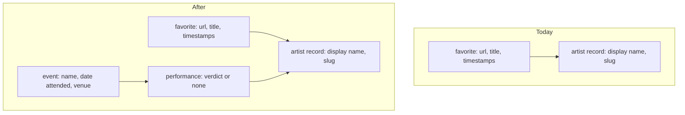
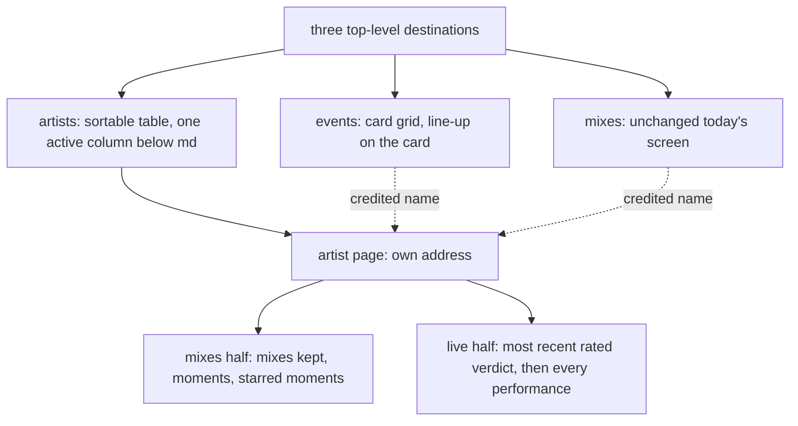

# Events and Artist Page - Plan

## Goal Capsule

- **Objective:** The operator can answer "who did I see that night" and "is this performer worth seeing again" inside GrooveMark, instead of reading a spreadsheet row and then searching the app by hand.
- **Means:** Record a night out as an event holding the performances seen there, each carrying a four-step verdict, and give every artist a page that puts their bookmarked mixes beside their live history.
- **Product authority:** This plan owns events, performances and their verdict, the events tab, the artists tab, the artist page, and the first navigation the app has. Renaming, merging and deleting artists are not active scope — see How This Work Fits Together.
- **Execution profile:** Cross-cutting. New collection, new store, new repository pair, the app's first router, two new destinations plus one addressable page, and a change to the export format.
- **Stop conditions:** Stop and ask if a requirement here would need artist repair — renaming or merging — to exist, or if the export has to keep reading files in the old shape after all.
- **Tail ownership:** This plan ends at a green branch. Commit, PR and CI belong to whoever runs the shipping step.

---

## Product Contract

### Summary

A night out becomes a record of its own — a name, a date, a venue, and the performers seen there, each carrying a verdict from dislike to three stars. The app grows three top-level destinations, and every artist gets a page that brings their bookmarked mixes together with their live history under one heading.

### Problem Frame

The operator already tracks live performances, outside the app, in a table with one row per performer per night: artist, score, date, event, venue. GrooveMark holds the other half of the same interest — the mixes bookmarked from those same performers — and the two halves never meet.

The cost lands on the second of the two questions rather than the first. Retrieving who played on a given night is a lookup the spreadsheet already answers. Judging a performer over time is the part that needs both halves at once: how many of their mixes were kept, how many moments in them were starred, and how the last live sets actually went. Today that means reading a row, then searching the app by name, and reconciling the two by eye.

Nothing in the app carries the live half. No event, venue, date-attended or performance-score concept exists in `src/` or `pocketbase/pb_migrations/`, and `Timestamp.rated` is the only score-like field anywhere (`src/types/favorite.ts:1-5`). The app also has no navigation at all: `src/App.vue` renders a single shell gated on `appStore.status`, and `vue-router` is absent from `package.json`. The two destinations this work needs are the first the app has ever had.

The operator will retype the existing table by hand rather than importing it, so entry and revision ergonomics decide whether the feature gets populated at all.

### Data shape

An event fans into the same artist records that favorites already reference, so the join the artist page rests on is identity, not a name string.

### Requirements

**Events and performances**

- R1. An event is a record carrying a name, a date attended and a venue, and it holds the performances the operator saw there.
- R2. A performance credits exactly one artist and carries at most one verdict. It exists as part of its event and nowhere else.
- R3. A verdict is one of four ordered values — dislike, one star, two stars, three stars. No numeric score and no fifth value exist.
- R4. A performance may carry no verdict, and an unrated performance still records that the operator saw that artist at that event.
- R5. A performance credits an artist by identity, and committing a name with no match creates that artist inline exactly as a mix's artist field does.
- R6. The event name and the venue are free text, each suggesting values already used by earlier events.
- R7. An event holding no performance is valid and appears in the events tab.
- R8. Creating an event and adding, editing or removing all of its performances happen on one surface, and the event saves or fails as a whole.

**The events tab**

- R9. The events tab renders one card per event, in a grid following the same column progression as the mixes grid — one column below `md`, then fixed-width columns as width allows.
- R10. An event card shows the event's name, date and venue, then every performance it holds with the credited artist and that performance's verdict.
- R11. Events are ordered by date attended, most recent first.

**The artist page**

- R12. Every artist has a page, reachable from the artists tab and from a credited artist's name wherever one is shown.
- R13. The artist page shows the mixes crediting that artist together with three counts: mixes kept, moments across those mixes, and starred moments among them.
- R14. The artist page leads its live half with the verdict of the most recent rated performance and the date of that performance, then lists every performance from most recent to oldest with its event, date, venue and verdict.
- R15. An artist with no mix, or with no performance, shows that half as empty rather than omitting it.

**The artists tab**

- R16. The artists tab lists every artist credited by at least one mix or one performance. An artist nothing credits does not appear.
- R17. From `md` up, the artists tab is a table sortable by any of its columns: artist, mixes, moments, starred moments, performances, most recent verdict, and date last seen. Its most-recent-verdict column shows the latest performance's verdict as it stands, marking it unrated when it is, which differs deliberately from R14's leading summary.
- R18. Below `md`, the artists tab shows each artist's name and the value of the active sort column only, and changing the sort changes which value is shown.
- R19. The artists tab offers a text search over artist names.

**Navigation**

- R20. The app has three top-level destinations — mixes, events, artists — and the mixes destination keeps the layout, grid, sidebar artist filter, search and sort it has today. Its import and export controls stay in place, carrying the format R22 to R24 define.
- R21. The artist page has an address of its own, so it can be reopened directly and shared. Events have no address of their own.

**Backup and portability**

- R22. One JSON export carries both mixes and events, and one import restores both from that file.
- R23. The import reads only the new format, and rejects a file in the previous bare-array shape rather than reading it partially.
- R24. Events in the export credit artists by name rather than by internal identity, so an export restores onto a different account or instance.

**Access control**

- R25. The events collection is readable and writable only by the account owning the record — on create as well as read, update and delete — and rejects an owner submitted by anyone else.

### Destinations and regions

### Key Decisions

- **A night out is a record holding its performances, rather than one row per performer.** A mistyped venue cannot split one night into two, and the date and venue are corrected in a single place. (session-settled: user-directed — chosen over a flat performance row grouped at display time, and over merging mixes and live sets into one object: fewer keystrokes per festival and one place to fix a night.) Governs R1, R2.
- **The verdict is a four-step ordinal ending in a dislike, not a number.** It answers "would I go back", which is not a quantity worth averaging. (session-settled: user-directed — chosen over an integer out of ten, five stars, and a decimal out of ten.) Governs R3, R14.
- **A verdict is optional.** Recording who played is worth keeping even with no opinion to attach. (session-settled: user-directed — chosen over requiring one on every performance: a performer caught for three minutes would otherwise go unrecorded, defeating the first of the two goals.) Governs R4, R14.
- **The artist page leads on the most recent rated performance, not simply the most recent one.** An unrated latest night would otherwise silence the summary exactly when it is being consulted. The artists tab's column deliberately does the opposite and reports the latest verdict as it stands. Governs R14, R17.
- **One surface creates and revises a whole event.** Retuning every verdict across a line-up at once matters more than the fastest first capture. (session-settled: user-directed — chosen over a keyboard-stacking field on a dedicated event page, and over entering all names first and attaching verdicts in a second pass.) Governs R8, R21.
- **Events render as cards in the mixes grid, not as a full-width list.** Below `md` that grid is already a single column, so a phone gets the full-width reading either way. (session-settled: user-directed — chosen over a full-width chronological list and a year-grouped timeline.) Governs R9, R10.
- **The artists tab catalogues performers seen only live alongside bookmarked ones.** (session-settled: user-directed — chosen over listing only artists holding a mix, and over listing everything behind a default has-a-mix filter: retrieving a performer seen once is the first of the two goals.) Governs R16.
- **The artists tab is a sortable table above `md`, and a name-plus-active-column list below it.** Sorting is what turns a catalogue into an answer to "is this performer worth seeing again". (session-settled: user-directed — chosen over a dense list, a card grid, a two-tier row, an expandable row, and a horizontally scrolling table.) Governs R17, R18.
- **The export becomes one file in a new shape, with no backward compatibility.** An older file is brought forward by wrapping it, which the operator can do by hand once. (session-settled: user-directed — chosen over two separate export files, over leaving events out of the export, and over an import reading both shapes.) Governs R22, R23. This supersedes R12 of [the artist entity plan](2026-09-05-2309-feat-artist-entity-plan.md), which pinned the export to its bare-array shape.
- **The venue stays free text with suggestions, not a record.** A misspelled venue costs only a duplicate suggestion, where a misspelled artist would have split a join. Governs R6.
- **Events belong to one account, scoped exactly like favorites and artists.** Governs R25.

### Key Flows

- F1. Recording a night out
  - **Trigger:** The operator opens the events tab and starts a new event.
  - **Steps:** The event's name and venue suggest values used by earlier events, and the date is entered. Each performer seen is added as a performance whose artist field suggests known artists and creates an unknown one on commit. A verdict is attached to a performance or left off. The whole event is saved in one action.
  - **Outcome:** One event holds every performance the operator recorded for that night, and every credited performer resolves to an artist record.
  - **Covers:** R1, R4, R5, R6, R8.

- F2. Deciding whether to see a performer again
  - **Trigger:** The operator opens the artists tab and sorts it, or opens a performer's page from a credited name.
  - **Steps:** The table is sorted by the column that matters — starred moments, performances, most recent verdict. Opening a performer shows the mixes half with its three counts, and the live half led by the most recent rated verdict and its date, followed by every performance.
  - **Outcome:** Both halves of what is known about the performer are readable on one page, without leaving the app.
  - **Covers:** R13, R14, R17.

- F3. Restoring from a backup
  - **Trigger:** The operator imports a JSON file.
  - **Steps:** A file in the previous bare-array shape is rejected outright. A file in the new shape restores mixes and events together, resolving each artist name it carries to an existing artist or creating one.
  - **Outcome:** Mixes and events are both restored, and no artist exists twice under two spellings within the imported set.
  - **Covers:** R22, R23, R24.

### Acceptance Examples

- AE1. **Covers R4, R14.** Given a performer whose most recent performance carries no verdict and whose previous one carries two stars, when their page is opened, then the live half leads with two stars and the date of that earlier performance, not with an unrated summary.
- AE2. **Covers R4.** Given an event being saved, when one of its performances has no verdict selected, then the event saves and that performance is listed with the artist credited and no verdict shown.
- AE3. **Covers R14, R15.** Given a performer with performances but none of them rated, when their page is opened, then the live half shows no leading verdict and still lists every performance.
- AE4. **Covers R16.** Given a performer credited by one performance and no mix, when the artists tab is opened, then that performer is listed with no mix count and their performance count.
- AE5. **Covers R16.** Given a performer credited only by one event, when that event is deleted, then the performer no longer appears in the artists tab.
- AE6. **Covers R5.** Given a performance's artist field, when the operator commits a name matching an existing artist under a different casing or accent, then the performance credits the existing artist and no second artist is created.
- AE7. **Covers R5.** Given a performance's artist field, when the operator commits a name that is empty once trimmed, then no artist is created and no performance is added.
- AE8. **Covers R8.** Given an event whose save fails, when the failure surfaces, then none of its performances are persisted and the operator's entered values are still on screen.
- AE9. **Covers R18.** Given the artists tab below `md` sorted by starred moments, when the operator changes the sort to most recent verdict, then each row's shown value changes from starred moments to that performer's most recent verdict.
- AE10. **Covers R23.** Given a JSON file exported before this change, when it is imported, then the import is rejected with the format named and nothing in the app changes.
- AE11. **Covers R24.** Given an export taken on one account, when it is imported on a different account, then every event's performances credit artists resolved on that account rather than failing on unknown identities.
- AE12. **Covers R21.** Given an artist page opened from a credited name, when its address is reopened in a new tab, then the same performer's page is shown.
- AE13. **Covers R20.** Given the mixes destination, when this work has shipped, then its grid, sidebar artist filter, search and sort behave as they do today.
- AE14. **Covers R17.** Given a performer whose latest performance is unrated and whose previous one carries two stars, when the artists tab is sorted by most recent verdict, then their row reports the latest performance as unrated, while their page still leads with two stars per R14.
- AE15. **Covers R11.** Given events attended in three different years, when the events tab is opened, then the most recently attended event appears first.

### Scope Boundaries

**Deferred for later**

- Renaming an artist, and the merge that falls out of renaming onto an existing name. Both were considered for this plan and moved out of it.
- Deleting artist records that nothing references. R16 hides them from the artists tab; the collection still grows monotonically.
- A rating or a like at the level of a whole mix. R13's counts aggregate what already exists instead.
- An event's own rating, its price, who came along, and photographs.
- A dedicated CSV import, and any importer that maps the operator's existing spreadsheet columns.
- An address of its own for an event.

**Accepted limitations**

- Two spellings of the same performer created independently stay two artists until the deferred merge ships. This plan adds a second place where a name is typed, so it widens that exposure without changing the mechanism.
- A performer whose name was mistyped once stays suggestible in both artist fields, because suggestions are drawn from every loaded artist while R16 only hides uncredited ones from the artists tab. This carries forward from [the artist entity plan](2026-09-05-2309-feat-artist-entity-plan.md).
- The operator's existing table is retyped by hand. Nothing in this plan shortens that pass beyond the suggestions in R6 and the single-surface entry in R8.
- The same performer playing twice on the same night is recorded as two performances of the same event, with no notion that they are one billing split across two sets.

**Not addressed by this plan**

- Reconciliation of writes made while the backend is unreachable. The authenticated offline path is read-only by design, and reconnecting treats the server list as the source of truth (`docs/explanation/architecture.md`); this plan neither widens nor closes that.
- A full festival line-up as published, as opposed to the performances the operator actually saw.
- Any change to how a mix credits its artists.

### Success Criteria

- A festival night with ten performers is entered without retyping its name, date or venue for each one.
- Opening a performer's page answers whether to see them again from that page alone, with no cross-referencing.
- A performer seen once and never bookmarked is found from the artists tab, by name search or by sorting on date last seen.
- An export taken after this ships restores both mixes and events onto an empty account, and every performance's artist is credited.
- The mixes destination reads and behaves as it does today, apart from the navigation it gains and the export format R22 to R24 define.

<!-- ce-section: work-relationships -->

### How This Work Fits Together

This plan owns one area: events, and the artist page that joins them to mixes. The breakdown below is how the surrounding work is currently understood, not a committed roadmap — a later plan may revise, split or discard it.

- **Artists as a first-class record** — shipped, in [the artist entity plan](2026-09-05-2309-feat-artist-entity-plan.md) and recorded in [ADR-0002](../decisions/0002-artists-as-a-first-class-record.md).
  - This plan depends on it: a performance credits an artist by identity (R5), which is what makes the artist page's join trustworthy.
  - This plan supersedes its R12: the export no longer keeps its bare-array shape.
- **Artist repair** — renaming an artist, merging two spellings, and removing a record nothing credits.
  - Depends on this plan for the artist page, which is where a rename belongs.
  - Enables the removal of the two accepted limitations above about diverging spellings.
  - Still to decide: whether a rename rewrites the derived name mirror on every crediting record, and what a merge does to performances as well as favorites.
- **Venues as records** — grouping nights by place, with a place corrected in one location.
  - Can proceed independently of this plan; R6 keeps the venue as free text with suggestions.
  - Still to decide: whether the operator wants a venue axis at all, which this plan does not establish.

### Dependencies / Assumptions

- The artist entity, its inline creation from an artist field, and its owner-scoped collection with a unique index on account and slug are in place (`src/types/artist.ts`, `pocketbase/pb_migrations/`). This plan builds on them and does not restate them.
- Artist matching already ignores case, accents and surrounding whitespace (`src/utils/artist.ts`). R5 inherits that behaviour rather than defining its own.
- An event holding no performance is allowed rather than rejected — an agent inference, not a stated preference. R7 owns the rule; overturning it changes R7 and adds a validation state to R8.
- The mixes grid is a single column below `md` and fixed-width columns above it (`src/assets/tailwind.css`). R9 rests on that, and the layout it needs comes from the existing tokens rather than new ones.
- Only the operator's own account uses the app, so no requirement here concerns concurrent editing by two people.

### Outstanding Questions

**Resolve Before Planning**

- None.

**Deferred to Planning**

- Whether performances are stored inside their event or as their own records. R2 fixes the product meaning — a performance exists only as part of its event — and leaves the storage shape open. The artist page's live half (R14) needs every performance crediting one artist, so the choice turns on how that is read back.
- Whether the events collection reuses the artists relation shape or denormalizes artist names alongside it, mirroring how a favorite carries both.
- Which router mode the app adopts, and how the existing single-shell state machine in `src/App.vue` composes with it.
- How the artists tab's counts are computed and kept current as mixes and events change.
- The date format and picker used for a date attended, and whether a date is required.

### Sources

- `src/types/favorite.ts:1-17` — `Timestamp.rated` is the only score-like field; `Favorite` carries both `artists` names and `artistIds`.
- `src/types/artist.ts` — an artist record carries a display name and a slug.
- `src/utils/artist.ts` — name normalization and the resolve-or-create helper this plan's R5 inherits.
- `src/services/artistsRepository.ts` — the repository exposes list, create, find-by-slug and a batch create, and no rename, update, delete or merge. This is why artist repair is a separate area, not an omission.
- `src/stores/favoritesUi.ts` — the artist list is derived from the artists credited by favorites, and the grid filter matches on identity while the search box matches on names. R16 extends that derivation to performances.
- `src/stores/favorites.ts` — the export payload and the import loop's artist resolution, both of which R22 to R24 change.
- `src/services/favoriteImport.ts` — the current import validation, which R23 replaces.
- `src/App.vue`, `src/components/layout/HeaderBar.vue`, `package.json` — no router and no navigation affordance exist today.
- `src/assets/tailwind.css` — the layout tokens, semantic layout classes and the custom breakpoints R9 and R17 depend on.
- `pocketbase/pb_migrations/` — the tracked schema migrations, including the owner-scoped rules and unique index R25 mirrors.
- `docs/reference/pocketbase-schema.md`, `docs/explanation/architecture.md` — the collection contract and the persistence rules this plan must keep true.
- `docs/reference/responsive-layout.md`, `docs/conventions/frontend-layout.md` — the layout contract R9, R17 and R18 must not break.
- `AGENTS.md` — the store-responsibility split this plan must not break.
